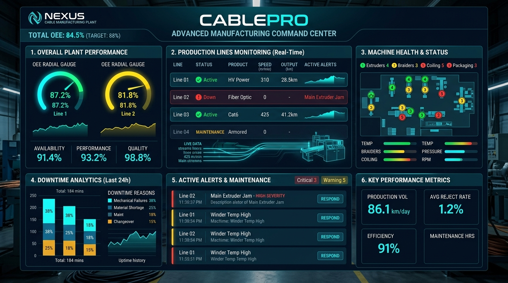
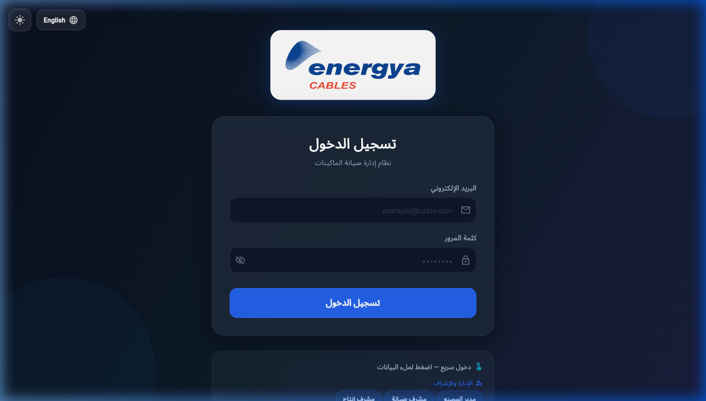
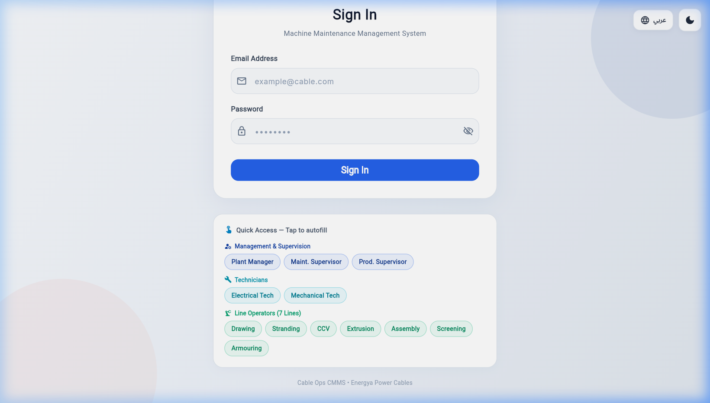
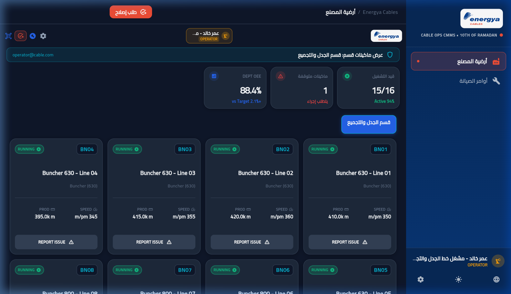
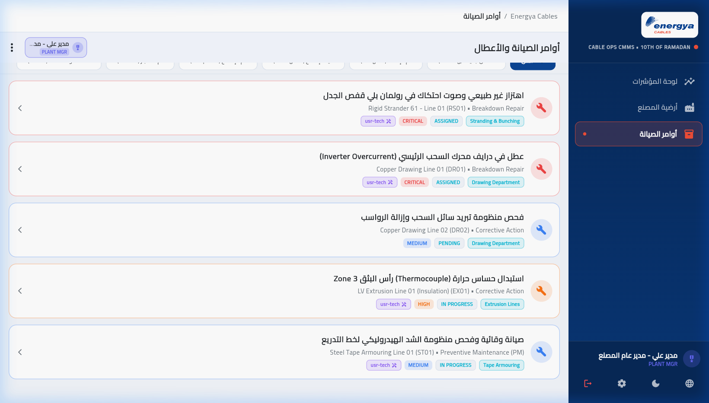
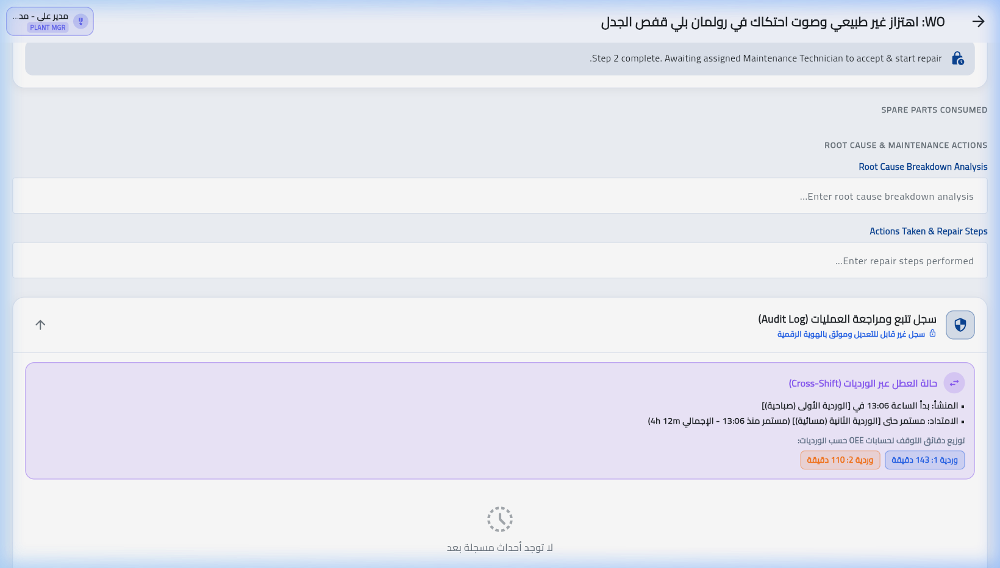
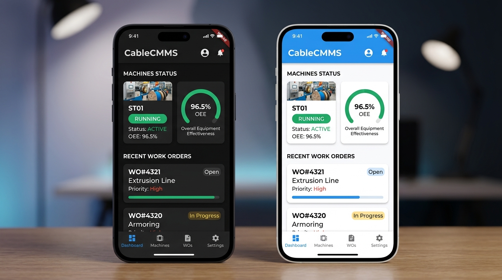
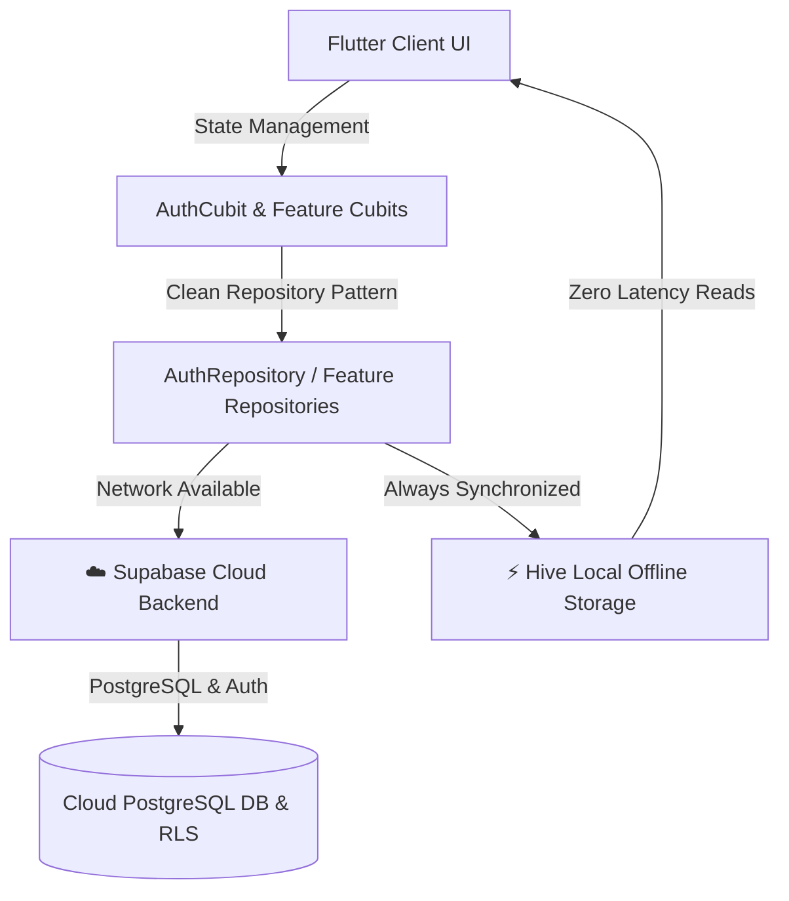
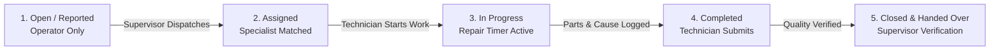

<div align="center">

# Cable Ops CMMS — Monorepo

This repository contains the Energya Cables maintenance platform. The Flutter app and web dashboard are isolated in separate top-level folders and share the Supabase database project.

| Directory | Purpose |
| --- | --- |
| [`mobile/`](mobile/) | Flutter / Dart mobile and desktop application |
| [`web/`](web/) | Vue 3, Vite, TypeScript web dashboard |
| [`supabase/`](supabase/) | Database migrations, RLS policies, triggers, and seed data |
| [`docs/`](docs/) | Product and architecture documentation |

## Getting started

### Mobile
```bash
cd mobile
flutter pub get
flutter run
```

### Web
```bash
cd web
cp .env.example .env.local # PowerShell: Copy-Item .env.example .env.local
# Set VITE_SUPABASE_URL and VITE_SUPABASE_ANON_KEY in .env.local
npm install
npm run dev
```

For Vercel or Cloudflare Pages, set the project root directory to `web` and configure the two `VITE_SUPABASE_*` variables in the host settings.

### Supabase
Apply the ordered SQL files under [`supabase/migrations/`](supabase/migrations/) before running [`supabase/seed.sql`](supabase/seed.sql). The idempotent seed contains seven departments, reference roles, sample spare parts, and an EX01 machine BOM. `EX01` is the stable database identifier for the line commonly written as EX-01. Create/invite actual users through Supabase Auth; do not commit passwords or service-role keys.

---

# 🏭 Energya Cables — Industrial CMMS
### Advanced Machinery Monitoring, Maintenance & Operational Lifecycle Management System
**نظام إدارة الصيانة الشامل والعمليات الصناعية المتطورة لمصانع الكابلات**



[](https://flutter.dev)
[](https://dart.dev)
[](https://supabase.com)
[](https://bloclibrary.dev)
[](https://docs.hivedb.dev)
[]()
[]()
[]()

</div>

---

## 📌 Executive Summary | نبذة عن النظام

**Energya Cables Industrial CMMS** is a mission-critical, enterprise-grade Computerized Maintenance Management System engineered specifically for continuous, heavy-duty industrial cable manufacturing facilities (10th of Ramadan / Sadat City plants).

In high-speed cable production, an unrecorded 15-minute extruder halt or drawing line friction fault can cascade into significant tonnage losses and delayed shipments. This platform eliminates paper-based shift logs and unauthorized overrides by providing a **tamper-proof, role-governed digital pipeline** connecting:
1. **7 Production Line Operators** (Wire Drawing, Stranding, CCV Insulation, Sheathing, Drum Twisting, Screening, and Armouring).
2. **Specialized Maintenance Technicians** (Electrical & Mechanical trades).
3. **Shift Maintenance & Production Supervisors**.
4. **Plant General Management**.

Built with **Flutter**, **Clean Feature-First Architecture**, **Supabase Cloud Backend**, and **Offline-First Hive persistence**, the system guarantees uninterrupted operation in high-interference factory floors with zero latency.

---

## 📸 Visual Tour & System Screenshots | جولة مصورة داخل النظام

### 1. Modern Industrial Authentication & Quick-Access Portal
*Equipped with Energya Power Cables identity, dynamic Arabic/English flipping, live dark/light mode toggle, and instant one-tap role selection for plant personnel:*

<div align="center">

| 🌙 Cyber Dark Mode (الوضع الليلي الصناعي) | ☀️ Clean Light Mode (الوضع النهاري عالي التباين) |
| :---: | :---: |
|  |  |

</div>

---

### 2. Factory Floor Operator View (أرضية المصنع لمشغلي الخطوط)
*Real-time machine status cards, telemetry (production speed m/min, produced km), department OEE gauges (88.4%), and immediate single-tap breakdown reporting:*

<div align="center">



*Line Operator Screen — Buncher 630 Lines with live running parameters, active alerts, and line-scoped visibility*

</div>

---

### 3. Work Orders Management & Handshake Lifecycle (أوامر الصيانة ودورة المصادقة)
*Multi-level management dashboard for dispatching specialists, tracking active timers, viewing replaced spare parts, and auditing cross-shift breakdowns:*

<div align="center">



*Desktop View — Work Orders with severity tagging (Critical / Medium / Preventive), assigned technician badges, and status filters*

</div>

---

### 4. 5-Step Handshake & Cross-Shift Chronology Audit Log
*Tamper-proof digital lifecycle preventing unauthorized closure and accurately decomposing cross-shift breakdown minutes for OEE calculation:*

<div align="center">



*Audit Log & Step Maintenance Handshake — Immutable event timeline and cross-shift minute decomposition (Shift 1 vs Shift 2)*

</div>

---

### 5. Responsive Mobile & Tablet Experience
*Fluid adaptive interface supporting control-room desktop monitors, supervisor tablets, and rugged shop-floor mobile devices:*

<div align="center">



*Dual-Theme Mobile Navigation — Futuristic floating dock and high-density cards*

</div>

---

## 🏗️ System Architecture & Dual Storage Model | معمارية النظام ومزامنة البيانات

The system implements a resilient **Hybrid Cloud & Local Cache Architecture**:



### Why Dual Storage?
1. **Zero-Latency Shop-Floor UX**: Querying local Hive boxes takes `< 2ms`, allowing operators to inspect machinery metrics and scroll through dozens of machines without UI stutters.
2. **Guaranteed Uptime Under Wi-Fi Blackouts**: If the factory access point drops, operators can still report faults locally and review work orders. Once reconnected, changes synchronize seamlessly.
3. **Cloud Auditability & RLS**: All central operations, role updates, and historical timestamps are guarded by Supabase PostgreSQL Row-Level Security (RLS).

---

## 👥 Factory Org Structure & 12 Pre-Configured Accounts | الأدوار وحسابات المصنع

The system is fully seeded with **12 dedicated accounts** mirroring the actual cable plant organizational structure:

| Role / Line | Dedicated Email | Department / Specialty | Scope of Authority |
| :--- | :--- | :--- | :--- |
| 👔 **Plant General Manager** | `manager.prod@cable.com` | Plant Administration | Executive dashboards, plant-wide OEE metrics, MTTR/MTBF analytics, read-only oversight |
| 📋 **Maintenance Supervisor** | `eng.maint@cable.com` | Maintenance Engineering | Technician dispatch, ticket reassignment, technical validation, verified ticket closure |
| 🏭 **Production Supervisor** | `prod.sup@cable.com` | Production Department | Cross-line coordination, shift output analysis, breakdown oversight |
| ⚡ **Electrical Technician** | `tech.elec@cable.com` | **Electrical** Maintenance | Start electrical work orders, record spare parts, document electrical root causes |
| 🔧 **Mechanical Technician** | `tech.mech@cable.com` | **Mechanical** Maintenance | Start mechanical work orders, record replaced parts, execute repair timers |
| 🧵 **Drawing Line Operator** | `op.drawing@cable.com` | Line 1: Wire Drawing | Report Line 1 breakdowns, view machine telemetry, confirm test runs |
| 🌀 **Stranding Line Operator**| `operator@cable.com` | Line 2: Rigid Stranding | Report Line 2 breakdowns, view machine telemetry, confirm test runs |
| ⚡ **CCV Line Operator** | `op.ccv@cable.com` | Line 3: CCV Insulation | Report Line 3 breakdowns, view machine telemetry, confirm test runs |
| 🛡️ **Extrusion Line Operator**| `op.extrusion@cable.com`| Line 4: Sheathing / Extrusion | Report Line 4 breakdowns, view machine telemetry, confirm test runs |
| 📦 **Assembly Line Operator** | `op.assembly@cable.com` | Line 5: Drum Twisting / Assembly | Report Line 5 breakdowns, view machine telemetry, confirm test runs |
| 🛡️ **Screening Line Operator**| `op.screening@cable.com`| Line 6: Copper Wire Screening | Report Line 6 breakdowns, view machine telemetry, confirm test runs |
| ⛓️ **Armouring Line Operator**| `op.tape@cable.com` | Line 7: Steel Tape Armouring | Report Line 7 breakdowns, view machine telemetry, confirm test runs |

> 🔒 **Account Credentials:** Passwords must be configured securely and stored in a password manager or project vault. Never commit plaintext passwords to source control.

---

## 🛡️ 5-Step Handshake Lifecycle & Strict RBAC | دورة حياة أمر الصيانة ومصفوفة الصلاحيات

The lifecycle strictly prevents illegal state transitions and unauthorized role actions:



### Role Permissions Matrix:

| Action / Capability | 👷 Operator | 🔧 Maintenance Tech | 📋 Shift Supervisor | 👔 Plant Manager |
| :--- | :--- :--- :--- :--- |
| **Report Machine Breakdown** | ✅ (Assigned Line) | ❌ | ✅ (Any Line) | ❌ |
| **View Department Machines** | ✅ (Scoped) | ❌ | ✅ (All/Scoped) | ✅ (All Plant) |
| **Start Assigned Repair Work** | ❌ | ✅ (Assigned Only) | ❌ | ❌ |
| **Record Replaced Spare Parts**| ❌ | ✅ | ❌ | ❌ |
| **Assign / Dispatch Technicians** | ❌ | ❌ | ✅ | ❌ |
| **Confirm Machine Test Run** | ✅ | ❌ | ✅ | ❌ |
| **Final Verified Ticket Closure** | ❌ | ❌ | ✅ | ❌ |
| **Executive OEE & Pareto Analytics** | ❌ | ❌ | ✅ | ✅ (Full Access) |

---

## ⏱️ 3-Shift Plant Chronology & Minute-Precise OEE Allocation | محرك الورديات الصناعي

In 24/7 cable manufacturing plants, shifts span across calendar boundaries. This engine guarantees mathematical precision:
- **Shift 1 (Morning)**: `07:30` → `15:29` (Same production calendar date).
- **Shift 2 (Evening)**: `15:30` → `22:59` (Same production calendar date).
- **Shift 3 (Night)**: `23:00` → `07:29` (Spans midnight; timestamps between `00:00` and `07:29` are allocated to yesterday's production date).
- **Cross-Shift Breakdown Minute Splitter**: When a failure spans across shift handovers, downtime minutes are partitioned between the shifts (e.g. 143 min allocated to Shift 1, 110 min allocated to Shift 2) preventing false OEE penalties.

---

## 📐 Strict Modular Code Architecture (Max 250 Lines per File) | المعمارية المعيارية النظيفة

Every presentation screen and component is cleanly decomposed to avoid monoliths. No file in the module exceeds 250 lines:

| Modular Component | Path | Responsibility | Line Count |
| :--- | :--- | :--- | :---: |
| [login_screen.dart](mobile/lib/features/auth/presentation/screens/login_screen.dart) | `mobile/lib/features/auth/presentation/screens/` | Screen orchestration, lifecycle & animations | **214** |
| [login_form_card.dart](mobile/lib/features/auth/presentation/widgets/login/login_form_card.dart) | `mobile/lib/features/auth/presentation/widgets/login/` | Form container, input validation & sign-in trigger | **247** |
| [login_quick_access.dart](mobile/lib/features/auth/presentation/widgets/login/login_quick_access.dart) | `mobile/lib/features/auth/presentation/widgets/login/` | Quick-access account selection chips by role | **197** |
| [login_top_bar.dart](mobile/lib/features/auth/presentation/widgets/login/login_top_bar.dart) | `mobile/lib/features/auth/presentation/widgets/login/` | Floating action bar for language & theme toggles | **146** |
| [login_form_fields.dart](mobile/lib/features/auth/presentation/widgets/login/login_form_fields.dart) | `mobile/lib/features/auth/presentation/widgets/login/` | Standardized input fields styling & text field labels | **93** |
| [login_background.dart](mobile/lib/features/auth/presentation/widgets/login/login_background.dart) | `mobile/lib/features/auth/presentation/widgets/login/` | Industrial gradient canvas & ambient glow effects | **76** |
| [login_header_logo.dart](mobile/lib/features/auth/presentation/widgets/login/login_header_logo.dart) | `mobile/lib/features/auth/presentation/widgets/login/` | Elevated Energya brand logo with fallback banner | **52** |

---

## 🧪 Testing & Quality Assurance | الاختبارات وضمان الجودة

The repository maintains an automated test suite with **29 passing tests (100% pass rate)**:
1. **RBAC Handshake & Guards**: Verifies role segregation, preventing technicians and operators from executing out-of-scope transitions.
2. **Theme Toggle Interpolation Stability**: Prevents `TextStyle.lerp` inherited style crashes during live theme switching.
3. **Dynamic Arabic/English Directionality**: Validates runtime text switching and layout adaptation.
4. **Shift Chronology & Cross-Shift Splitter**: Guarantees post-midnight shift allocation and minute-accurate OEE calculations.
5. **Futuristic Navigation Bar**: Tests responsive switching between desktop sidebar and mobile navigation.

```bash
# Run the automated test suite
flutter test
```
```text
00:09 +29: All tests passed!
```

```bash
# Run strict static code analysis
dart analyze lib/ test/
```
```text
Analyzing lib, test...
No issues found!
```

---

## 🚀 Getting Started | طريقة التثبيت والتشغيل

### Prerequisites
- [Flutter SDK](https://flutter.dev) (v3.19 or higher)
- [Dart SDK](https://dart.dev) (v3.3 or higher)
- Git

### 1. Clone the Repository
```bash
git clone https://github.com/mahmoudshahin1/CMMS-Cable.git
cd CMMS-Cable
```

### 2. Install Dependencies
```bash
cd mobile
flutter pub get
```

### 3. Database & Supabase Provisioning
Execute the ordered migrations located in `supabase/migrations/` sequentially via your Supabase CLI or SQL Editor:
- Migrations are versioned and follow strict Row-Level Security (RLS) policies. Legacy provisioning scripts are deprecated and isolated under `supabase/legacy/`.

### 4. Run Automated Tests
```bash
flutter test
```

### 5. Launch Application
```bash
# For Chrome Web:
flutter run -d chrome

# For Windows Desktop:
flutter run -d windows
```

---

## 🛠️ Technology Stack | حزمة التقنيات

- **Framework**: [Flutter](https://flutter.dev) & [Dart](https://dart.dev)
- **Cloud Backend**: [Supabase](https://supabase.com) (PostgreSQL, Auth, Row-Level Security)
- **State Management**: [flutter_bloc](https://pub.dev/packages/flutter_bloc) / Cubit
- **Offline Persistence**: [Hive](https://pub.dev/packages/hive) & [Hive Flutter](https://pub.dev/packages/hive_flutter)
- **Dependency Injection**: [get_it](https://pub.dev/packages/get_it)
- **Design & Theming**: Modern Material 3, Custom Glassmorphism, Google Fonts (`Cairo` & `Inter`)

---

## 📄 License
This project is licensed under the MIT License - see the [LICENSE](LICENSE) file for details.

<div align="center">
Developed with ❤️ for Advanced Industrial Cable Manufacturing Excellence.
</div>
