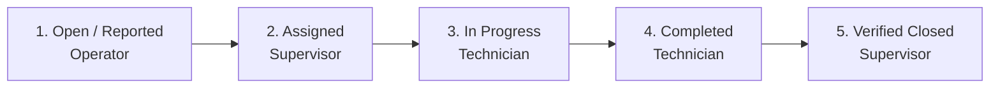

<div align="center">

# 🏭 Energya Cables — Industrial CMMS
### Advanced Machinery Monitoring, Maintenance & Operational Lifecycle Management System
**نظام إدارة الصيانة الشامل والعمليات الصناعية المتطورة لمصانع الكابلات**


[](https://flutter.dev)
[](https://dart.dev)
[](https://bloclibrary.dev)
[](https://docs.hivedb.dev)
[]()
[]()
[]()

</div>

---

## 📌 Overview | نظرة عامة

**Energya Cables Industrial CMMS** is a mission-critical, enterprise-grade Computerized Maintenance Management System engineered specifically for heavy industrial cable manufacturing plants. 

The platform bridges factory-floor operators, specialized electrical/mechanical maintenance technicians, shift supervisors, and executive plant managers into a synchronized, real-time workflow. Built with **Flutter**, **Clean Architecture**, and **Offline-First Hive persistence**, the application operates reliably in demanding industrial environments with zero latency.

نظام **Energya Cables CMMS** هو منصة صناعية متكاملة لإدارة صيانة وتشغيل خطوط إنتاج الكابلات، يربط بين مشغلي الماكينات، وفنيي الصيانة (كهرباء وميكانيكا)، ومشرفي الورادي، ومدير المصنع في بيئة رقمية آمنة وموثوقة تعمل بدون انقطاع.

---

## 📱 Mobile & Responsive Previews | لقطات من التطبيق

<div align="center">


*Sleek Dual Theme System: Cyber Navy (Dark Mode) & Energya Industrial Clean (Light Mode)*

</div>

---

## ✨ Core Pillars & Architectural Innovations | أبرز الميزات والمعمارية

### 1. 🛡️ 3-Tier RBAC & 5-Step Handshake Lifecycle
A rigorous, state-machine-governed workflow prevents operational fraud and unauthorized status overrides:

- **Operator**: Reports breakdowns and confirms test-run machine restart. Cannot complete tickets or assign personnel.
- **Maintenance Technician**: Assigned by speciality (Electrical / Mechanical). Executes repair timer, records spare parts, documents root cause and actions taken. Cannot approve or close tickets.
- **Maintenance Supervisor**: Dispatches technicians, reassigns tickets, validates work quality, and executes final verified closure.
- **Plant Manager**: High-level read-only executive visibility over plant-wide OEE, MTTR/MTBF metrics, and downtime Pareto distributions.

### 2. ⏱️ 3-Shift Plant Chronology & Minute-Precise OEE Allocation
Custom industrial engine designed specifically for continuous 24/7 manufacturing plants:
- **Shift 1 (Morning)**: `07:30` → `15:29` (Same production calendar date)
- **Shift 2 (Evening)**: `15:30` → `22:59` (Same production calendar date)
- **Shift 3 (Night)**: `23:00` → `07:29` (Midnight-spanning; logs after `00:00` are strictly allocated to yesterday's production date)
- **Cross-Shift OEE Splitter**: When a breakdown spans across shift handovers, downtime minutes are mathematically decomposed and allocated to the exact shifts for tamper-proof OEE and availability KPI reporting.

### 3. 📜 Full-Page Scroll Architecture (`CustomScrollView` & Slivers)
- Complete UI viewport optimization using `CustomScrollView`, `SliverLayoutBuilder`, and `SliverGrid`.
- Scrolling anywhere on the screen seamlessly scrolls the entire page upwards, giving **100% vertical real estate** to machine cards and work orders.
- Native `RefreshIndicator` support across all screens for instant one-touch pull-to-refresh.

### 4. 🌐 100% Arabic & English Language Isolation
- Zero text overlap or hardcoded string mixing.
- Full RTL and LTR directionality alignment.
- Dynamic localized arguments interpolation (`trArgs`) for live metrics, shift labels, and machine codes.

### 5. 🎨 Industrial Dual-Theme System
- **Dark Mode**: Cyber Deep Navy (`#0A0E1A`), Slate Cards (`#161F30`), and Electric Blue / Cyber Cyan accents for high-contrast low-glare visibility in factory control rooms.
- **Light Mode**: Energya Clean Industrial White with Deep Navy primary and High-Visibility Safety Orange accents.
- Unified typography (`Cairo` for Arabic, `Inter` for English) with mathematically consistent text style interpolation.

---

## 👥 Role Permissions Matrix | مصفوفة الصلاحيات والأدوار

| Action / Capability | 👷 Operator | 🔧 Maintenance Tech | 📋 Shift Supervisor | 👔 Plant Manager |
| :--- | :---: | :---: | :---: | :---: |
| **Report Machine Breakdown** | ✅ | ❌ | ✅ | ❌ |
| **View Department Machines** | ✅ (Scoped) | ❌ | ✅ (All/Scoped) | ✅ (All Plant) |
| **Start Assigned Repair Work** | ❌ | ✅ (Assigned Only) | ❌ | ❌ |
| **Record Replaced Spare Parts**| ❌ | ✅ | ❌ | ❌ |
| **Assign / Dispatch Technicians** | ❌ | ❌ | ✅ | ❌ |
| **Confirm Machine Test Run** | ✅ | ❌ | ✅ | ❌ |
| **Final Verified Ticket Closure** | ❌ | ❌ | ✅ | ❌ |
| **Executive OEE & Pareto Analytics** | ❌ | ❌ | ✅ | ✅ (Full Access) |

---

## 📂 Project Architecture | هيكل المشروع

```
lib/
├── core/
│   ├── chronology/             # Shift engine & cross-shift breakdown splitter
│   ├── database/               # Hive service & offline persistence adapters
│   ├── di/                     # GetIt dependency injection setup
│   ├── localization/           # 100% isolated strings dictionary & LocaleCubit
│   ├── theme/                  # Industrial Light & Dark theme definitions & cubit
│   ├── utils/                  # Responsive helpers (Mobile, Tablet, Desktop)
│   └── widgets/                # Reusable industrial UI components & badges
├── features/
│   ├── assets/                 # Plant overview, machinery cards, QR scanning
│   ├── work_orders/            # 5-step handshake lifecycle & activity timeline
│   ├── downtime/               # Downtime logging & shift minute tracking
│   ├── analytics/              # OEE radial gauge & Pareto downtime distribution
│   └── auth/                   # 3-tier RBAC, user models & settings
└── main.dart                   # MultiBlocProvider & responsive navigation shell
```

---

## 🧪 Testing & Quality Assurance | الاختبارات وضمان الجودة

The repository includes a comprehensive, automated test suite covering:
1. **RBAC Handshake Tests**: Persona switching, role guards, and operational boundaries.
2. **3-Tier Defense-in-Depth Tests**: Anti-tamper verification, cross-technician rejection, illegal state skip prevention.
3. **Shift Chronology Tests**: Boundary precision, post-midnight production date mapping, multi-shift downtime minute splitter.
4. **Theme Toggle Interpolation Tests**: Asymmetry prevention and `TextStyle.lerp` mathematical stability.

Run all tests via terminal:
```bash
flutter test
```
```
00:06 +23: All tests passed!
```

Verify static analysis:
```bash
flutter analyze
```
```
Analyzing orning_and_evening_remembrances...
No issues found! (ran in 9.7s)
```

---

## 🚀 Getting Started | طريقة التشغيل

### Prerequisites
- [Flutter SDK](https://flutter.dev) (v3.19 or later)
- [Dart SDK](https://dart.dev) (v3.3 or later)
- Git

### Installation & Run
```bash
# 1. Clone the repository
git clone https://github.com/mahmoudshahin1/CMMS-Cable.git

# 2. Navigate to project directory
cd CMMS-Cable

# 3. Fetch dependencies
flutter pub get

# 4. Run automated tests
flutter test

# 5. Launch the application
flutter run
```

---

## 🛠️ Technology Stack | حزمة التقنيات المستخدمة

- **Framework**: [Flutter](https://flutter.dev) & [Dart](https://dart.dev)
- **State Management**: [flutter_bloc](https://pub.dev/packages/flutter_bloc) / Cubit
- **Local Storage**: [Hive](https://pub.dev/packages/hive) & [Hive Flutter](https://pub.dev/packages/hive_flutter)
- **Dependency Injection**: [get_it](https://pub.dev/packages/get_it)
- **Typography**: [google_fonts](https://pub.dev/packages/google_fonts) (Cairo & Inter)
- **Visuals & Charts**: Custom Canvas, Custom Painter, Material 3 Design
- **Architecture**: Clean Architecture (Domain, Data, Presentation)

---

## 📄 License

This project is licensed under the MIT License - see the [LICENSE](LICENSE) file for details.

---

<div align="center">
Developed with ❤️ for Advanced Industrial Cable Manufacturing Excellence.
</div>
