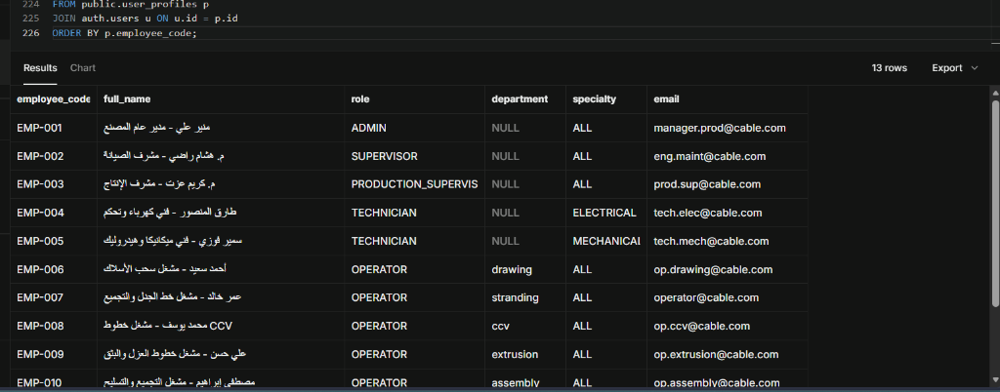
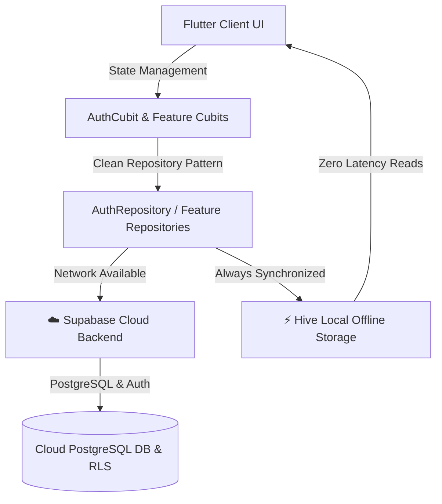
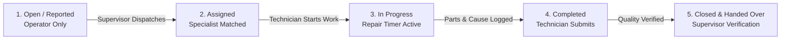

<div align="center">

# 🏭 Energya Cables — Industrial CMMS
### Advanced Machinery Monitoring, Maintenance & Operational Lifecycle Management System
**نظام إدارة الصيانة الشامل والعمليات الصناعية المتطورة لمصانع الكابلات**



[](https://flutter.dev)
[](https://dart.dev)
[](https://supabase.com)
[](https://bloclibrary.dev)
[](https://docs.hivedb.dev)
[]()
[]()
[]()

</div>

---

## 📌 Overview | نظرة عامة

**Energya Cables Industrial CMMS** is a mission-critical, enterprise-grade Computerized Maintenance Management System engineered specifically for heavy industrial cable manufacturing facilities. 

The platform bridges factory-floor machine operators, specialized electrical and mechanical technicians, shift supervisors, and executive plant leadership into a unified, real-time operational workflow. Built with **Flutter**, **Clean Architecture**, **Supabase Cloud Backend**, and **Offline-First Hive persistence**, the system guarantees high-availability operations under demanding shop-floor conditions.

نظام **Energya Cables CMMS** هو منصة صناعية متكاملة لإدارة صيانة وتشغيل خطوط إنتاج الكابلات، يربط بين مشغلي الماكينات الـ 7، وفنيي الصيانة التخصصيين (كهرباء وميكانيكا)، ومشرفي الورادي، والإدارة العامة للمصنع في بيئة رقمية آمنة وموثوقة تعمل لحظياً مع دعم العمل دون اتصال.

---

## 🏗️ System Architecture & Dual Storage Model | معمارية النظام ومزامنة البيانات

The system implements a resilient **Hybrid Cloud & Local Cache Architecture**:



- **☁️ Supabase Cloud Backend**: Handles secure user authentication, centralized `user_profiles`, machine statuses, breakdown tickets, and audit trails with PostgreSQL Row-Level Security (RLS).
- **⚡ Hive Local Database**: Provides instantaneous offline-first caching for shop-floor tablets and workstations, ensuring zero latency when viewing machine telemetry and creating local logs.
- **🔄 Fault-Tolerant Hybrid Strategy**: Network calls gracefully fall back to cached credentials and local data boxes during factory connectivity interruptions.

---

## 👥 Factory Org Structure & 12 Pre-Configured Accounts | الأدوار وحسابات المصنع

The system is fully provisioned with **12 dedicated accounts** mirroring the actual cable plant hierarchy:

| Role / Line | Dedicated Account | Specialty / Assigned Unit | Permissions & Access Scope |
| :--- | :--- | :--- | :--- |
| 👔 **Plant General Manager** | `manager.prod@cable.com` | Plant-Wide Operations | Executive dashboards, OEE metrics, MTTR/MTBF analytics, read-only plant-wide oversight |
| 📋 **Maintenance Supervisor** | `eng.maint@cable.com` | Maintenance Engineering | Technician dispatch, ticket reassignment, technical validation, verified ticket closure |
| 🏭 **Production Supervisor** | `prod.sup@cable.com` | Production Coordination | Cross-line monitoring, shift output analysis, breakdown oversight |
| ⚡ **Electrical Technician** | `tech.elec@cable.com` | **Electrical** Specialty | Start electrical work orders, record spare parts, document electrical root causes |
| 🔧 **Mechanical Technician** | `tech.mech@cable.com` | **Mechanical** Specialty | Start mechanical work orders, record replaced parts, execute repair timers |
| 🧵 **Drawing Line Operator** | `op.drawing@cable.com` | Line 1: Wire Drawing | Report Line 1 breakdowns, view machine telemetry, confirm test runs |
| 🌀 **Stranding Line Operator**| `operator@cable.com` | Line 2: Rigid Stranding | Report Line 2 breakdowns, view machine telemetry, confirm test runs |
| ⚡ **CCV Line Operator** | `op.ccv@cable.com` | Line 3: CCV Insulation | Report Line 3 breakdowns, view machine telemetry, confirm test runs |
| 🛡️ **Extrusion Line Operator**| `op.extrusion@cable.com`| Line 4: Sheathing / Extrusion | Report Line 4 breakdowns, view machine telemetry, confirm test runs |
| 📦 **Assembly Line Operator** | `op.assembly@cable.com` | Line 5: Drum Twisting / Assembly | Report Line 5 breakdowns, view machine telemetry, confirm test runs |
| 🛡️ **Screening Line Operator**| `op.screening@cable.com`| Line 6: Copper Wire Screening | Report Line 6 breakdowns, view machine telemetry, confirm test runs |
| ⛓️ **Armouring Line Operator**| `op.tape@cable.com` | Line 7: Steel Tape Armouring | Report Line 7 breakdowns, view machine telemetry, confirm test runs |

> **Default Initial Password for Seed Accounts:** `Cable@2026!`

---

## 🛡️ 5-Step Handshake Lifecycle & Strict RBAC | دورة حياة أمر الصيانة ومصفوفة الأمان

The lifecycle strictly prevents illegal state transitions and unauthorized role actions:



- **Operator**: Can only report breakdowns for their assigned line and confirm machine test runs after repair. Cannot complete tickets or dispatch technicians.
- **Maintenance Technician**: Restricted to assigned work orders matching their trade (Electrical/Mechanical). Replaces spare parts, records root causes. Cannot approve or close tickets.
- **Maintenance Supervisor**: Dispatches technicians, validates technical execution, and executes final verified closure.
- **Plant Manager**: Executive high-level monitoring over plant OEE, downtime Pareto charts, and plant availability.

---

## 💻 Industrial UI/UX & Modular Code Architecture | الواجهة وتفكيك الكود المعياري

### 🎨 Design & Accessibility
- **Energya Industrial Branding**: High-contrast, clean visual design featuring Energya Power Cables branding.
- **Dynamic Dual Theme**:
  - **Cyber Dark**: Deep industrial navy (`#0A0E1A`), slate containers (`#161F30`), and cyan accents for factory floor control panels.
  - **Clean Light**: Glare-free white/slate layout with high-visibility safety orange indicators.
- **100% Arabic & English Isolation**: Real-time language toggling with dynamic RTL/LTR layout flipping, zero text overlap, and full Cairo/Inter typography support.
- **Quick Role Selector**: Convenient one-tap credentials population for rapid QA, testing, and factory role demonstration.

### 📐 Strict Modular Clean Architecture (Code Length $\le 250$ Lines)
All presentation layers are strictly partitioned into single-responsibility sub-widgets:

| Modular Component | Path | Responsibility | Lines |
| :--- | :--- | :--- | :---: |
| [login_screen.dart](file:///h:/orning_and_evening_remembrances/lib/features/auth/presentation/screens/login_screen.dart) | `lib/features/auth/presentation/screens/` | Screen orchestration, lifecycle & animations | **214** |
| [login_form_card.dart](file:///h:/orning_and_evening_remembrances/lib/features/auth/presentation/widgets/login/login_form_card.dart) | `lib/features/auth/presentation/widgets/login/` | Form container, input validation & sign-in trigger | **247** |
| [login_quick_access.dart](file:///h:/orning_and_evening_remembrances/lib/features/auth/presentation/widgets/login/login_quick_access.dart) | `lib/features/auth/presentation/widgets/login/` | Quick-access account selection chips by role | **197** |
| [login_top_bar.dart](file:///h:/orning_and_evening_remembrances/lib/features/auth/presentation/widgets/login/login_top_bar.dart) | `lib/features/auth/presentation/widgets/login/` | Floating action bar for language & theme toggles | **146** |
| [login_form_fields.dart](file:///h:/orning_and_evening_remembrances/lib/features/auth/presentation/widgets/login/login_form_fields.dart) | `lib/features/auth/presentation/widgets/login/` | Standardized input fields styling & text field labels | **93** |
| [login_background.dart](file:///h:/orning_and_evening_remembrances/lib/features/auth/presentation/widgets/login/login_background.dart) | `lib/features/auth/presentation/widgets/login/` | Industrial gradient canvas & ambient glow effects | **76** |
| [login_header_logo.dart](file:///h:/orning_and_evening_remembrances/lib/features/auth/presentation/widgets/login/login_header_logo.dart) | `lib/features/auth/presentation/widgets/login/` | Elevated Energya brand logo with fallback banner | **52** |

---

## 🧪 Testing & Quality Assurance | الاختبارات وضمان الجودة

The repository includes a comprehensive, automated test suite with **29 passing tests**:
1. **RBAC Handshake & Guards**: Enforces role boundaries, preventing technicians and operators from unauthorized actions.
2. **Theme Toggle Interpolation Stability**: Prevents `TextStyle.lerp` inherited style crashes during live theme switching.
3. **Dynamic Arabic/English Directionality**: Validates runtime text switching and layout adaptation.
4. **Shift Chronology & Cross-Shift Splitter**: Guarantees post-midnight shift allocation and minute-accurate OEE calculations.
5. **Futuristic Navigation Bar**: Tests responsive switching between desktop sidebar and mobile navigation.

```bash
# Run the automated test suite
flutter test
```
```text
00:09 +29: All tests passed!
```

```bash
# Run strict static code analysis
dart analyze lib/ test/
```
```text
Analyzing lib, test...
No issues found!
```

---

## 🚀 Getting Started | طريقة التثبيت والتشغيل

### Prerequisites
- [Flutter SDK](https://flutter.dev) (v3.19 or higher)
- [Dart SDK](https://dart.dev) (v3.3 or higher)
- Git

### 1. Clone the Repository
```bash
git clone https://github.com/mahmoudshahin1/CMMS-Cable.git
cd CMMS-Cable
```

### 2. Install Dependencies
```bash
flutter pub get
```

### 3. Database & Supabase Provisioning
Execute the pre-configured SQL script in your Supabase SQL Editor to provision schemas, tables, and the 12 factory seed accounts:
- Open [`supabase_fix_and_provision_all.sql`](supabase_fix_and_provision_all.sql) in Supabase Studio SQL Editor and click **Run**.

### 4. Run Automated Tests
```bash
flutter test
```

### 5. Launch Application
```bash
# For Chrome Web:
flutter run -d chrome

# For Windows Desktop:
flutter run -d windows
```

---

## 🛠️ Technology Stack | حزمة التقنيات

- **Framework**: [Flutter](https://flutter.dev) & [Dart](https://dart.dev)
- **Cloud Backend**: [Supabase](https://supabase.com) (PostgreSQL, Auth, Row-Level Security)
- **State Management**: [flutter_bloc](https://pub.dev/packages/flutter_bloc) / Cubit
- **Offline Persistence**: [Hive](https://pub.dev/packages/hive) & [Hive Flutter](https://pub.dev/packages/hive_flutter)
- **Dependency Injection**: [get_it](https://pub.dev/packages/get_it)
- **Design & Theming**: Modern Material 3, Custom Glassmorphism, Google Fonts (`Cairo` & `Inter`)

---

## 📄 License
This project is licensed under the MIT License - see the [LICENSE](LICENSE) file for details.

<div align="center">
Developed with ❤️ for Advanced Industrial Cable Manufacturing Excellence.
</div>
