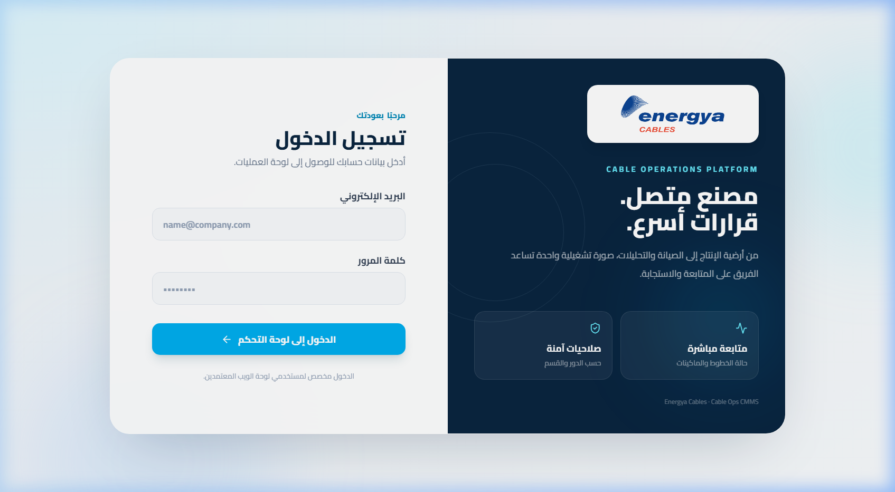
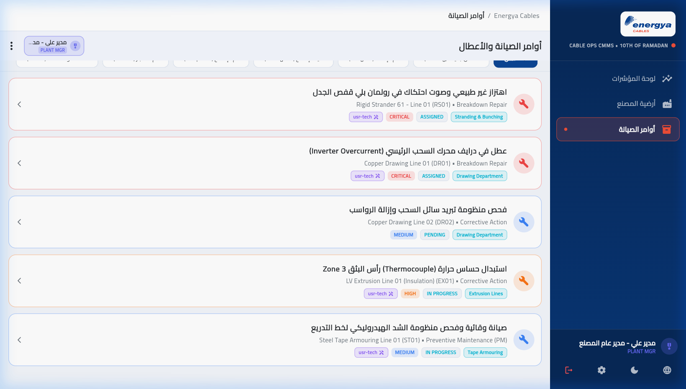
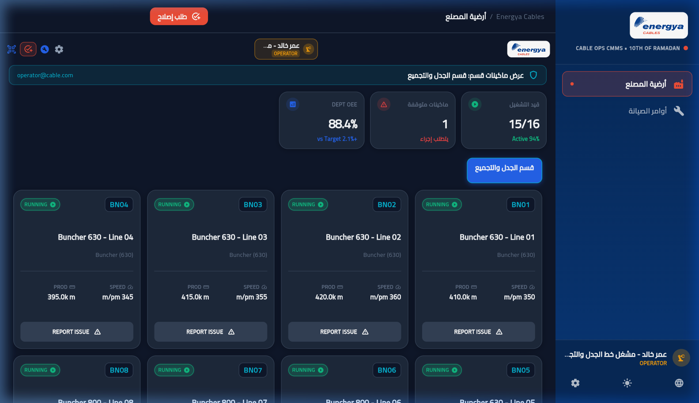
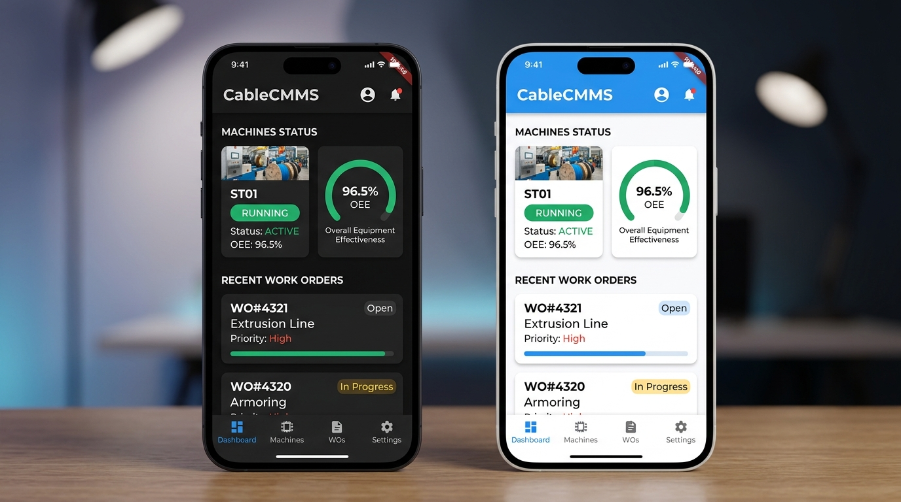
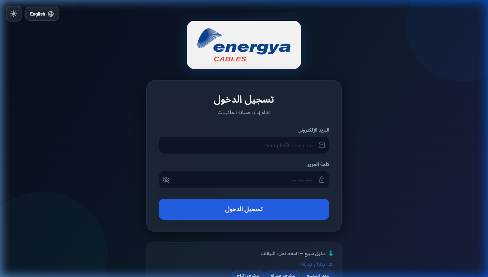
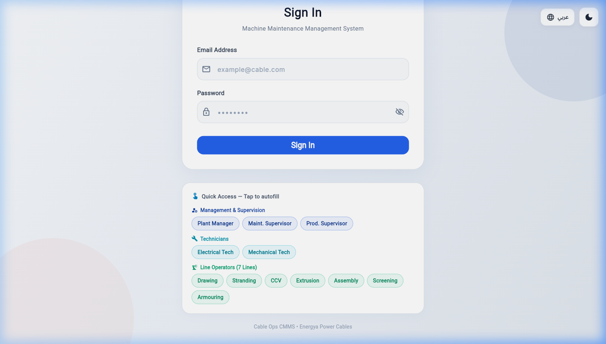
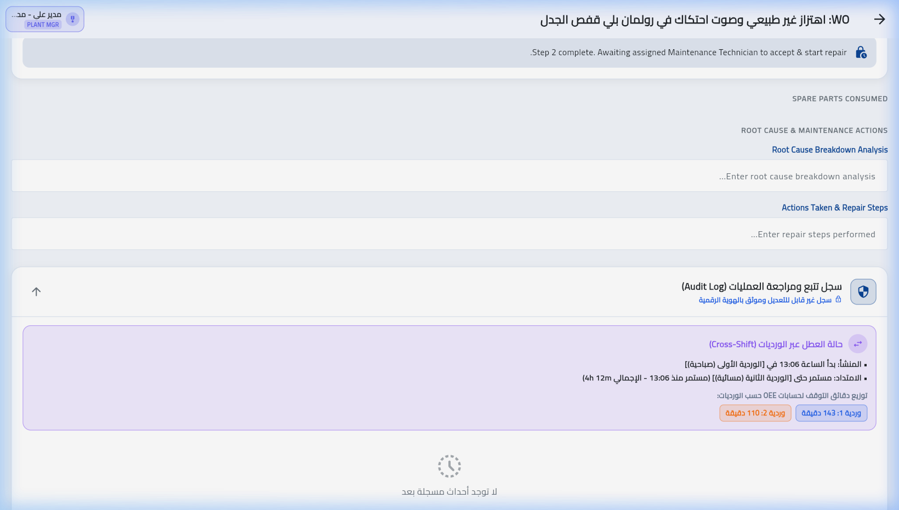

<div align="center">

# 🏭 Energya Cables — Factory CMMS Platform
### Computerized Maintenance Management System for Cable & Wire Manufacturing Plants

[](https://flutter.dev)
[](https://vuejs.org)
[](https://supabase.com)
[](https://bloclibrary.dev)
[](https://docs.hivedb.dev)

**One shop floor. One source of truth.**  
**Two apps — mobile for the floor, web for the office — both reading and writing the same database in real time.**

</div>

---

## 📋 Table of Contents

1.  [Tech Stack](#-tech-stack)
2.  [What This Is](#-what-this-is)
3.  [Monorepo Layout](#-monorepo-layout)
4.  [Screenshots](#-screenshots)
5.  [System Architecture](#-system-architecture)
6.  [The Work Order Lifecycle (Report → Close)](#-the-work-order-lifecycle-report--close)
7.  [Roles & Permissions](#-roles--permissions)
8.  [Realtime Behavior](#-realtime-behavior)
9.  [Getting Started](#-getting-started)
10. [Database Notes](#-database-notes)

---

## 🧰 Tech Stack

### 📱 Mobile Application

| Layer | Technology | Purpose |
| :--- | :--- | :--- |
| **Framework** | Flutter 3.x / Dart 3.x | Cross-platform native UI for Android & iOS |
| **State Management** | flutter_bloc (BLoC / Cubit) | Predictable state, separated business logic |
| **Local Database** | Hive (Offline-First) | Zero-latency reads (<2 ms), works without network |
| **Dependency Injection** | get_it | Service locator for clean architecture |
| **Backend Client** | supabase_flutter | Auth, Realtime, RPC calls to Supabase |
| **Barcode / QR** | mobile_scanner | Machine identification via barcode scan |
| **Typography** | google_fonts (Cairo) | Arabic-first UI with RTL support |
| **Unique IDs** | uuid (v4) | Idempotent offline command generation |
| **Architecture** | Clean Architecture, Feature-First | Modular: `auth`, `assets`, `work_orders`, `downtime`, `analytics` |

### 🖥️ Web Dashboard

| Layer | Technology | Purpose |
| :--- | :--- | :--- |
| **Framework** | Vue 3 (Composition API) | Reactive supervisor/management portal |
| **Build Tool** | Vite 8.x | Instant HMR, optimized production bundles |
| **Language** | TypeScript | Type-safe codebase |
| **State Management** | Pinia 4.x | Lightweight, type-safe stores |
| **Charts & Analytics** | Apache ECharts 6 + vue-echarts | OEE gauges, Pareto, shift heatmaps, bar/pie charts |
| **Icons** | Lucide Vue | Clean, consistent icon set |
| **CSS** | Tailwind CSS 3.x | Utility-first styling with RTL support |
| **Routing** | Vue Router 5.x | Auth guards, role-based route protection |
| **Deployment** | GitHub Pages (CI/CD) | Auto-deploy on push via GitHub Actions |

### 🗄️ Database & Backend

| Layer | Technology | Purpose |
| :--- | :--- | :--- |
| **Platform** | Supabase Cloud | Managed PostgreSQL + Auth + Realtime |
| **Database** | PostgreSQL 15+ | Relational data with JSONB, views, functions |
| **Auth** | Supabase Auth (email/password) | JWT-based session management |
| **Security** | Row Level Security (RLS) | Every table gated by role + department |
| **Business Logic** | SECURITY DEFINER RPC functions | Transactional state transitions with version checks |
| **Realtime** | Logical Replication (WebSocket) | Live broadcast of all operational table changes |
| **Migrations** | Supabase CLI (10 ordered migrations) | Versioned, reproducible schema management |
| **Reporting** | 7 PostgreSQL views | `v_machine_status_live`, `v_downtime_pareto`, `v_work_order_funnel`, etc. |

---

## 📌 What This Is

A maintenance-management platform purpose-built for **continuous-process manufacturing lines** (wire drawing, stranding, insulation/extrusion, armouring, etc.), where unplanned downtime on any single line directly destroys in-progress production batches.

The system replaces paper fault logs and verbal handovers with **one digital record** that:

- Lets a **machine operator** report a fault from the shop floor in seconds *(mobile)*.
- Lets a **maintenance supervisor** assign the right technician immediately *(mobile or web)*.
- **Tracks the entire repair** — parts consumed, root cause, actions taken — against that one record.
- **Requires the operator to confirm** the machine actually runs correctly before anyone can close it.
- Gives **plant management** a live, read-and-act dashboard *(web)* with zero manual reporting.

Every state change is version-controlled and append-only audited, so the question **"who did what, and when"** always has a verifiable answer.

---

## 📂 Monorepo Layout

```
CMMS-Cable/
├── mobile/          Flutter app — used by operators and technicians on the shop floor
│   ├── lib/
│   │   ├── features/        Feature modules (auth, assets, work_orders, downtime, analytics)
│   │   ├── core/            Shared services (database, DI, theme, localization, config)
│   │   ├── app.dart         MaterialApp configuration, themes, session guards
│   │   └── main.dart        Entry point — initializes Supabase, Hive, GetIt
│   ├── android/             Android platform configuration
│   └── pubspec.yaml         Flutter dependencies
│
├── web/             Vue 3 + Vite dashboard — used by supervisors and plant management
│   ├── src/
│   │   ├── api/             Supabase client initialization
│   │   ├── stores/          Pinia stores (auth, workOrders, downtime, locale)
│   │   ├── views/           Dashboard screens (Login, PlantFloor, WorkOrders, Analytics, …)
│   │   ├── components/      Shared components (AppShell, StatusBadge)
│   │   ├── lib/             Business logic (roles, workOrders, downtime)
│   │   ├── router/          Routes and auth guards
│   │   └── style.css        Global styles, RTL, Cairo font
│   ├── serve_dist.js        Lightweight local server for built output
│   ├── package.json         Dependencies & scripts
│   └── vite.config.ts       Build config with ECharts chunk splitting
│
├── supabase/        Database schema, RLS policies, and RPC functions (single source of truth)
│   ├── migrations/          10 ordered SQL migration files
│   ├── migrations_down/     Rollback scripts for emergencies
│   ├── seed.sql             Factory reference data (7 departments, roles, machines, BOM, spare parts)
│   └── PRODUCTION_BASELINE.md
│
├── docs/            Architecture notes and screenshots
│   ├── SCHEMA.md            Full table-by-table data contract
│   ├── PROJECT_GUIDE_AR.md  Technical guide in Arabic
│   └── images/              App screenshots and mockups
│
├── release_apks/    Pre-built APKs for direct Android installation
└── README.md        This file
```

Both front ends talk to the **same Supabase project** — there is no separate mobile API and web API. A fault reported on a phone appears on the web dashboard within a second, with no manual sync step.

---

## 📸 Screenshots

> Captured directly from the running applications. The layout and flow are what matters here.

### Web Application

<table>
<tr>
<td width="50%">

**🔐 Web Login Portal**  
Branded Energya Cables sign-in with full Arabic RTL support, professional split-panel design.



</td>
<td width="50%">

**📋 Work Orders Queue (Web)**  
Every open and in-progress fault across every department, filterable by line, status, and priority.



</td>
</tr>
</table>

### Mobile Application

<table>
<tr>
<td width="50%">

**🏭 Shop Floor — Operator View (Mobile)**  
Live machine status cards, department OEE (88.4%), running/stopped indicators, production meters, line speed, and a one-tap "Report Issue" action per machine.



</td>
<td width="50%">

**📱 Mobile Dashboard — Dark & Light Themes**  
Machine status cards (ST01), OEE gauge (96.5%), recent work orders list, and bottom navigation. Both dark industrial and clean light modes supported.



</td>
</tr>
<tr>
<td width="50%">

**🔐 Mobile Login — Dark Mode**  
Role-aware quick access panel: one-tap login for any of the 12 factory accounts grouped by Management, Technicians, and Line Operators. Theme toggle and Arabic/English language switch.



</td>
<td width="50%">

**🔐 Mobile Login — Light Mode**  
Same quick access functionality in clean high-contrast light theme with full English UI.



</td>
</tr>
</table>

### Work Order Detail — Mid-Lifecycle

<div align="center">

**📋 Work order detail showing mid-lifecycle status tracking**  
Status tracked against the real handshake step (here: repair assigned, waiting for the technician to accept & start). Root cause fields, actions taken, spare parts consumed, the append-only audit log, and **cross-shift downtime split** (Shift 1: 143 min, Shift 2: 110 min) — all on the same record.



</div>

---

## 🏗️ System Architecture

```
┌─────────────────────┐         ┌─────────────────────┐
│    Mobile App        │         │     Web App          │
│    (Flutter)         │         │   (Vue 3 / Vite)     │
│   Operators &        │         │   Supervisors &      │
│   Technicians        │         │   Plant Managers     │
└──────────┬───────────┘         └──────────┬───────────┘
           │                                │
           │         same project           │
           └────────────┬───────────────────┘
                        ▼
          ┌──────────────────────────┐
          │        Supabase          │
          │  • PostgreSQL 15+ DB     │
          │  • Row Level Security    │
          │  • SECURITY DEFINER      │
          │    RPC functions (9)     │
          │  • Realtime (logical     │
          │    replication / WS)     │
          │  • 7 Reporting Views     │
          │  • Supabase Auth (JWT)   │
          └──────────────────────────┘
```

### Why a single backend matters here

The web dashboard is **not** a reporting copy of mobile data — it is a second client of the exact same tables, gated by the exact same role-based security rules. There is no reconciliation job, no nightly export, and no risk of the two apps disagreeing about the state of a machine.

### Why RPC functions instead of direct table writes

Every state transition (assign, start repair, complete, confirm test run, close) is a dedicated PostgreSQL function that:

1. **Re-checks the caller's role** server-side (never trusts the client).
2. **Checks an optimistic-concurrency version number**, so two people acting on the same fault at the same moment can't silently overwrite each other — the second writer gets a clear conflict instead of a lost update.
3. **Writes an immutable audit event** as part of the same transaction.

### Mobile Offline-First Architecture

The mobile app uses a **Dual Storage Model** (Hive + Supabase):

- **Zero-latency reads**: Machine data is read from local Hive boxes in <2 ms — no screen freezing when browsing dozens of machines.
- **Offline operation**: In RF-shielded production halls, operators can log faults locally. When Wi-Fi returns, the `SyncManager` flushes the outbox queue without losing any record.
- **Idempotency**: Every offline command carries a UUID v4 key. If the database receives the same key twice (retry storm), it skips the duplicate safely.

---

## 🔄 The Work Order Lifecycle (Report → Close)

This is the core of the system. A work order moves through exactly **seven states**, enforced entirely in the database — neither app can skip a step or assign itself a permission it doesn't have.

```
 OPEN ──► ASSIGNED ──► IN PROGRESS ──► COMPLETED ──► VERIFIED ──► CLOSED
                            │ ▲
                            ▼ │
                      PENDING PARTS
```

| # | Status | What happens | Who can do it |
| :---: | :--- | :--- | :--- |
| **1** | **Open** | An operator reports a fault from the shop floor: machine, fault type, priority, and a description. The machine is immediately flagged down on every screen, everywhere. | Operator, Supervisor |
| **2** | **Assigned** | A maintenance supervisor assigns the fault to a specific technician. This can now be done from either the mobile app or the web dashboard. | Maintenance Supervisor, Plant Manager, Admin |
| **3** | **In Progress** | The assigned technician accepts the job and starts the repair. | Technician |
| **3a** | **Pending Parts** *(optional loop)* | If a spare part is needed, the technician flags the work order as waiting on parts, then resumes once the part is available — without losing any history. | Technician |
| **4** | **Completed** | The technician finishes the physical repair and records the root cause and the actions taken before handing the machine back. | Technician |
| **5** | **Verified** | The operator runs the machine and confirms the fix actually works under real production conditions — this step exists specifically so a fault can't be closed on paper while the machine is still misbehaving. | Operator |
| **6** | **Closed** | A production engineer or supervisor gives the final sign-off and closes the record. This can now be done from either the mobile app or the web dashboard. | Production Supervisor, Maintenance Supervisor, Plant Manager, Admin |

### What's tracked automatically at every step (no extra data entry):

- ✅ A full, **append-only timeline event** per transition (who, what, when) — visible on both apps and updated live.
- ✅ **Parts consumed** against the work order, deducted from spare-parts stock automatically.
- ✅ **Machine status** (running / down / under maintenance) kept in sync with the work order status — nobody has to remember to update it separately.
- ✅ **Total downtime duration**, split by shift (Morning / Evening / Night), for later analysis.

> **Following a fault live:** once a work order exists, any authorized user — on mobile or on the web — sees every subsequent step the moment it happens, with no refresh and no polling. Assigning a technician from the web dashboard shows up on the technician's phone instantly, and vice versa.

---

## 👥 Roles & Permissions

| Role | Can use web dashboard | Can report a fault | Can assign a technician | Can perform the repair | Can confirm the fix | Can close the fault |
| :--- | :---: | :---: | :---: | :---: | :---: | :---: |
| **Operator** | — | ✅ | — | — | ✅ | — |
| **Technician** | — | — | — | ✅ | — | — |
| **Maintenance Supervisor** | ✅ | ✅ | ✅ | — | — | ✅ |
| **Production Supervisor** | ✅ | ✅ | — | — | — | ✅ |
| **Plant Manager / Admin** | ✅ | ✅ | ✅ | — | — | ✅ |

**Two independent layers enforce this:**

1. **Interface level** — an account without web access is redirected to a "use the mobile app" screen instead of the dashboard. This is a usability choice, not a security boundary.
2. **Database level (the real boundary)** — every RPC function re-validates the caller's role before touching data, and Row Level Security scopes what each role can even query. This holds regardless of which app, or which screen, the request comes from.

### Factory Accounts (12 pre-provisioned users)

| Role | Email | Department |
| :--- | :--- | :--- |
| 👔 Plant Manager | `manager.prod@cable.com` | General Management |
| 📋 Maintenance Supervisor | `eng.maint@cable.com` | Maintenance Engineering |
| 📋 Production Supervisor | `prod.sup@cable.com` | Production Management |
| ⚡ Electrical Technician | `tech.elec@cable.com` | Electrical Maintenance |
| 🔧 Mechanical Technician | `tech.mech@cable.com` | Mechanical Maintenance |
| 🧵 Drawing Operator | `op.drawing@cable.com` | Line 1: Wire Drawing |
| 🌀 Stranding Operator | `operator@cable.com` | Line 2: Stranding |
| ⚡ CCV Line Operator | `op.ccv@cable.com` | Line 3: CCV Insulation |
| 🛡️ Extrusion Operator | `op.extrusion@cable.com` | Line 4: Extrusion |
| 📦 Assembly Operator | `op.assembly@cable.com` | Line 5: Assembly |
| 🛡️ Screening Operator | `op.screening@cable.com` | Line 6: Screening |
| ⛓️ Armouring Operator | `op.tape@cable.com` | Line 7: Armouring |

> 🔐 Passwords are managed via Supabase Auth and are **not** included in the repository.

---

## ⚡ Realtime Behavior

Every screen that shows live operational state — the shop-floor view, the work order queue, and an individual work order's timeline — subscribes to **Postgres change events** instead of polling.

**Practical effect:** change a machine's status or move a work order forward from any client, and every other open screen (any device, any role permitted to see it) updates within about a second, with the connection state visibly indicated.

**Published tables:** `machines`, `work_orders`, `work_order_events`, `work_order_parts`, `downtime_logs`.

---

## 🚀 Getting Started

### Prerequisites

- [Node.js](https://nodejs.org) v18+ (tested on v22.12.0)
- [Flutter SDK](https://flutter.dev) v3.19+
- [Dart SDK](https://dart.dev) v3.3+
- Git

### Mobile (Flutter)

```bash
cd mobile
flutter pub get
flutter run
```

### Web (Vue 3 + Vite)

```bash
cd web
npm install
cp .env.example .env.local   # fill in your Supabase project URL + anon key
npm run dev
```

### Database (Supabase CLI)

```bash
cd supabase
supabase link --project-ref <your-project-ref>
supabase db push
```

### Required environment variables for the web app

```env
VITE_SUPABASE_URL=https://<your-project-ref>.supabase.co
VITE_SUPABASE_ANON_KEY=<your-anon-key>
```

> The anon key is safe to ship in a public bundle — it carries no privilege on its own. All real access control lives in Row Level Security and the RPC functions described above.

### Live Demo (GitHub Pages)

The web dashboard is auto-deployed to GitHub Pages on every push to `main`:

🔗 **[https://mahmoudshahin1.github.io/CMMS-Cable/](https://mahmoudshahin1.github.io/CMMS-Cable/)**

---

## 🗄️ Database Notes

### Schema Overview

The database is structured around these core tables:

| Table | Purpose |
| :--- | :--- |
| `user_profiles` | One profile per auth identity — `role`, `department`, `specialty`, `employee_code` |
| `machines` | Machine registry — `code`, `name`, `department`, `status`, `current_speed_mpm`, `total_meters_produced` |
| `work_orders` | Core maintenance records — UUID `id`, `status`, `priority`, `type`, timestamps, `root_cause`, `actions_taken`, JSONB `chronology`, integer `version` |
| `work_order_events` | Immutable audit trail — `actor_id`, `event_type`, `occurred_at`, status transitions, JSONB `payload` |
| `work_order_parts` | Consumed spare parts — `part_code`, `part_name`, `quantity`, `unit_cost`, `added_by` |
| `downtime_logs` | Machine downtime — `machine_id`, `category`, `reason`, `started_at`, `ended_at`, JSONB `shift_minutes` |
| `spare_parts` | Stock catalog — `part_code`, `name`, `quantity_on_hand`, `reorder_level` |
| `machine_bom` | Bill of materials linking machines to spare parts |
| `factory_departments` | Reference: 7 factory departments (`code`, `name_en`, `name_ar`) |
| `factory_roles` | Reference: role definitions with `web_access` flag |

### Workflow RPC Functions

All writes go through transactional RPC functions — clients **cannot** directly mutate operational tables:

| RPC | Purpose |
| :--- | :--- |
| `rpc_create_work_order` | Create work order + audit/command records |
| `rpc_assign_work_order` | Assign a technician (supervisor only) |
| `rpc_start_work_order` | Start repair (assigned technician only) |
| `rpc_add_work_order_part` | Record a consumed spare part |
| `rpc_complete_work_order` | Record root cause/actions, mark repair complete |
| `rpc_confirm_test_run` | Operator verifies the machine runs correctly |
| `rpc_close_work_order` | Final supervisor sign-off |
| `rpc_create_downtime_log` | Start tracking downtime |
| `rpc_close_downtime_log` | Close downtime with shift allocation |

### Reporting Views

| View | What it provides |
| :--- | :--- |
| `v_machine_status_live` | Current machine status with latest downtime reason |
| `v_downtime_pareto` | Downtime by category, ranked for Pareto analysis |
| `v_work_order_funnel` | Work order count by status |
| `v_line_availability_daily` | Department availability % over last 7 days |
| `v_mttr_by_department` | Mean Time To Repair by department |
| `v_bad_actors_30d` | Machines with most breakdowns in 30 days |
| `v_shift_downtime_split` | Downtime minutes split by Morning / Evening / Night shift |

### Key Design Decisions

- **Schema, policies, and functions** are defined as versioned SQL migrations under `supabase/migrations/`, applied in order — this is the single source of truth for both apps.
- See [`docs/SCHEMA.md`](docs/SCHEMA.md) for the full table-by-table reference.
- Because every write RPC carries an **idempotency key** and a **version check**, retried or offline-queued mobile requests cannot double-apply or silently clobber a concurrent web edit.
- **No `work_order_num` column** exists — the UUID `id` is the primary key; the UI displays its first 8 characters (e.g., `WO-A1B2C3D4`) as a human-friendly short label.
- **Shift engine**: factory runs 24/7 across 3 shifts (07:30–15:30, 15:30–23:00, 23:00–07:30). Downtime crossing midnight is mathematically split across shifts for accurate OEE reporting.

---

<div align="center">

**Built for Energya Cables · Cable Ops CMMS**

</div>
