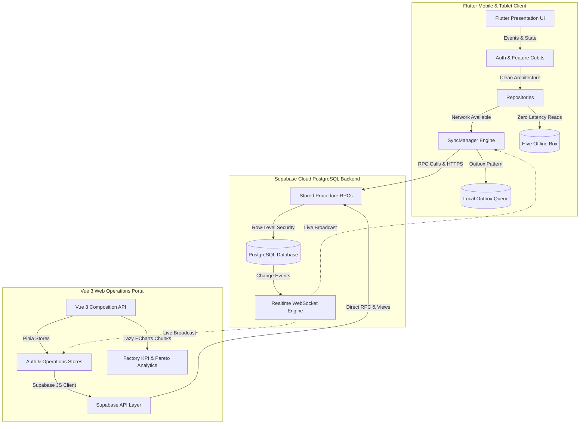
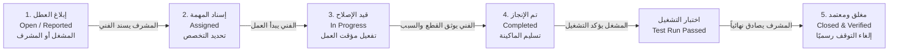

<div align="center">

# 🏭 Cable Ops CMMS — Energya Cables
### Advanced Machinery Monitoring, Maintenance & Operational Lifecycle Management System
**نظام إدارة الصيانة الشامل والعمليات الصناعية المتطورة لمصانع الكابلات (إنرجيا للخدمات والصناعات الكهربائية)**

[]()
[](https://flutter.dev)
[](https://vuejs.org)
[](https://supabase.com)
[]()
[](https://docs.hivedb.dev)
[]()
[]()
[]()

</div>

---

## 📑 جدول المحتويات | Table of Contents

1. [نظرة عامة على المشروع (Executive Summary)](#-نظرة-عامة-على-المشروع--executive-summary)
2. [هيكل المستودع (Monorepo Directory Layout)](#-هيكل-المستودع--monorepo-directory-layout)
3. [معرض الشاشات الحية (Live Screenshots & Visual Tour)](#-معرض-الشاشات-الحية--live-screenshots--visual-tour)
4. [معمارية النظام الشاملة (System Architecture)](#-معمارية-النظام-الشاملة--system-architecture)
5. [دليل حل المشاكل والمشاكل التقنية (Troubleshooting & Solved Issues)](#-دليل-حل-المشاكل-والمشاكل-التقنية--troubleshooting--solved-issues)
6. [حسابات المصنع ومصفوفة الصلاحيات (Factory Accounts & RBAC)](#-حسابات-المصنع-ومصفوفة-الصلاحيات--factory-accounts--rbac)
7. [دورة حياة أمر الصيانة (5-Step Handshake Lifecycle)](#-دورة-حياة-أمر-الصيانة--5-step-handshake-lifecycle)
8. [محرك الورديات وحساب OEE (Plant Shift Chronology Engine)](#-محرك-الورديات-وحساب-oee--plant-shift-chronology-engine)
9. [دليل التثبيت والتشغيل بالتفصيل (Getting Started & Setup)](#-دليل-التثبيت-والتشغيل-بالتفصيل--getting-started--setup)
10. [الاختبارات وضمان الجودة (Testing & QA Assurance)](#-الاختبارات-وضمان-الجودة--testing--qa-assurance)

---

## 📌 نظرة عامة على المشروع | Executive Summary

**Cable Ops CMMS** هو نظام صناعي متكامل لإدارة الصيانة المحوسبة (Computerized Maintenance Management System)، صُمم خصيصاً لمصانع تصنيع كابلات الطاقة والجهد العالي والمنخفض (مثل مجمعات العاشر من رمضان ومدينة السادات لشركة إنرجيا للكابلات).

في بيئة تصنيع الكابلات المستمرة، فإن أي توقف غير مخطط له لخط سحب نحاس أو خط بثق (Extrusion) أو عزل مستمر (CCV) يؤدي إلى تلف فوري في دفعات الإنتاج وتكلفة باهظة للطن. يقضي هذا النظام تماماً على الدفاتر الورقية والتقارير الشفهية عبر توفير حلقة رقمية محكمة تربط:
1. **مشغلي خطوط الإنتاج السبعة (Line Operators)** للإبلاغ الفوري عن الأعطال ومراقبة سرعة الخط وعداد الإنتاج والـ OEE.
2. **فنيي الصيانة التخصصيين (Mechanical & Electrical Technicians)** لبدء الإصلاحات وتوثيق قطع الغيار المستهلكة وتسجيل الأسباب الجذرية والإجراءات.
3. **مشرفي ورديات الصيانة والإنتاج (Supervisors)** لتوزيع المهام، والتحقق الفني، ومصادقة إغلاق الأوامر.
4. **الإدارة العليا للمصنع (Plant Management)** للتحليلات التنفيذية، وتوزيع الـ OEE، وتحليل باريتو (Pareto)، وتقرير الماكينات الأكثر تعطلاً (Bad Actors).

---

## 📂 هيكل المستودع | Monorepo Directory Layout

تم تنظيم المشروع بنمط Monorepo لضمان استقلالية التطبيقات مع تشارك نفس قاعدة بيانات Supabase والعقود التشغيلية:

```
CMMS-Cable/
├── mobile/                        # تطبيق الموبايل والتابلت (Flutter / Dart)
│   ├── lib/
│   │   ├── features/              # المميزات مقسمة Feature-First (auth, assets, downtime, work_orders, analytics)
│   │   ├── core/                  # الأدوات الأساسية (database/hive, di, theme, localization, config)
│   │   ├── app.dart               # تكوين MaterialApp، الثيمات، وحراس الجلسة
│   │   └── main.dart              # نقطة البداية، تهيئة Supabase و Hive و GetIt
│   ├── android/                   # إعدادات ومنصات أندرويد الأصلية
│   └── pubspec.yaml               # مكتبات Flutter والاعتماديات
│
├── web/                           # لوحة التحكم والمراقبة للويب (Vue 3 + Vite + TypeScript)
│   ├── src/
│   │   ├── api/supabase.ts        # عميل Supabase Client ومفاتيح Anon
│   │   ├── stores/                # مخازن الحالة العامة (Pinia: auth, workOrders, downtime)
│   │   ├── views/                 # شاشات اللوحة (Login, PlantFloor, WorkOrders, Downtime, Analytics, SpareParts)
│   │   ├── components/            # المكونات المشتركة (AppShell, StatusBadge)
│   │   ├── router/index.ts        # المسارات وحراس التوجيه (Auth Guards)
│   │   └── style.css              # تصميم Tailwind، اتجاه RTL، وخط Cairo
│   ├── serve_dist.js              # سيرفر محلي خفيف لتشغيل النسخة المبنية (Port 5173)
│   ├── package.json               # حزم Vite و Vue 3 و ECharts
│   └── vite.config.ts             # إعدادات Vite وتقسيم Chunks
│
├── supabase/                      # قاعدة البيانات ومخططات السحابة
│   ├── migrations/                # ملفات SQL المرتبة تصاعدياً لتكوين البيئة النظيفة
│   ├── migrations_down/           # ملفات التراجع المقابلة لحالات الطوارئ
│   ├── seed.sql                   # بيانات المصنع المرجعية (7 أقسام، أدوار، ماكينات، BOM، قطع غيار)
│   ├── PRODUCTION_BASELINE.md     # وثيقة حصر حالة الإنتاج والمصالحة الآمنة
│   └── legacy/                    # السكربتات القديمة المؤرشفة
│
├── docs/                          # وثائق النظام والتصميم والمخططات
│   ├── PROJECT_GUIDE_AR.md        # الدليل الفني الشامل بالعربية لمسارات البيانات
│   ├── SCHEMA.md                  # عقد البيانات، جداول، RLS، والـ RPCs
│   ├── production_deployment_runbook.md # إرشادات النشر
│   └── images/                    # صور النظام، الاسكرين شوت، والمخططات
│
├── release_apks/                  # ملفات APK الجاهزة للتثبيت المباشر على أجهزة أندرويد
├── HANDOFF.md                     # تقرير التسليم وحالة التحقق والخطوات التشغيلية
└── README.md                      # هذا الدليل المرجعي الشامل
```

---

## 📸 معرض الشاشات الحية | Live Screenshots & Visual Tour

### 1. شاشة لوحة تحكم الويب أثناء التشغيل الحي (Live Web Portal)
*تم التقاط هذه اللقطة مباشرة من التطبيق أثناء تشغيل سيرفر الويب وتصفحه عبر المتصفح:*

<div align="center">


*بوابة الدخول للويب — هوية شركة إنرجيا للكابلات، دعم كامل للعربية RTL، وتصميم متجاوب واحترافي*

</div>

---

### 2. شاشات تطبيق الهاتف والمحاكاة المزدوجة (Mobile Dark & Light Experience)
*عرض تجربة الموبايل عبر الوضع الليلي المظلم عالي التباين (Cyber Dark) والوضع النهاري النظيف (Clean Light):*

<div align="center">


*تطبيق الموبايل — بطاقات الماكينات ST01، مؤشرات OEE الحية (96.5%)، قائمة أوامر العمل الأخيرة، والشريط العائم السفلي*

</div>

---

### 3. بوابة الدخول التفاعلية للموبايل مع الوصول السريع للأدوار (Mobile Quick Access)

<div align="center">

| 🌙 الوضع الليلي (Dark Industrial) | ☀️ الوضع النهاري (Clean High-Contrast) |
| :---: | :---: |
|  |  |

*دخول فوري بنقرة واحدة لاختيار أي دور وظيفي من الـ 12 حساباً مع التبديل اللحظي بين العربية والإنجليزية*

</div>

---

### 4. أرضية المصنع لمشغلي الخطوط (Factory Floor Live Operations)

<div align="center">


*شاشة المشغل — خطوط الجدل والإنتاج مع بارامترات السرعة (متر/دقيقة) والأمتار المنتجة وحالة الخط وزر الإبلاغ الفوري*

</div>

---

### 5. إدارة أوامر العمل وسجل المصادقة والورديات (Work Orders & Handshake Detail)

<div align="center">

| 🖥️ سطح المكتب: إدارة أوامر العمل وفلاتر الأقسام | 📋 تفاصيل الأمر وتفكيك دقائق الورديات |
| :---: | :---: |
|  |  |

*فلاتر شاملة لأوامر الصيانة، متابعة الخطوات الخمس، وتوزيع زمن العطل بين الورديتين (Shift 1 & Shift 2)*

</div>

---

## 🏗️ معمارية النظام الشاملة | System Architecture

يعتمد النظام معمارية **Hybrid Cloud & Local Cache Architecture** (Offline-First):


```mermaid
graph TD
    subgraph Mobile Client [Flutter Mobile & Tablet Client]
        UI[Flutter Presentation UI] -->|Events & State| BLoC[Auth & Feature Cubits]
        BLoC -->|Clean Architecture| Repo[Repositories]
        Repo -->|Network Available| SyncMgr[SyncManager Engine]
        Repo -->|Zero Latency Reads| LocalDB[(Hive Offline Box)]
        SyncMgr -->|Outbox Pattern| Outbox[(Local Outbox Queue)]
    end

    subgraph Web Dashboard [Vue 3 Web Operations Portal]
        WebUI[Vue 3 Composition API] -->|Pinia Stores| Stores[Auth & Operations Stores]
        Stores -->|Supabase JS Client| SupaClient[Supabase API Layer]
        WebUI -->|Lazy ECharts Chunks| Analytics[Factory KPI & Pareto Analytics]
    end

    subgraph Supabase Cloud [Supabase Cloud PostgreSQL Backend]
        SyncMgr -->|RPC Calls & HTTPS| RPC[Stored Procedure RPCs]
        SupaClient -->|Direct RPC & Views| RPC
        RPC -->|Row-Level Security| PG[(PostgreSQL Database)]
        PG -->|Change Events| RT[Realtime WebSocket Engine]
        RT -.->|Live Broadcast| SyncMgr
        RT -.->|Live Broadcast| Stores
    end
```

### أسباب اختيار نموذج التخزين المزدوج (Dual Storage Model):
1. **استجابة صفرية في المصنع (Zero Latency UX)**: قراءة بيانات الماكينات وحالاتها من صناديق Hive المحلية تأخذ أقل من `2ms`، مما يمنع تجمد الشاشات عند تصفح عشرات المعدات.
2. **استمرارية العمل عند انقطاع الشبكة (Wi-Fi Blackouts)**: في صالات الإنتاج الضخمة والمعزولة حديدياً، يمكن للمشغل تسجيل العطل محلياً؛ وبمجرد عودة إشارة الواي فاي، يقوم الـ `SyncManager` بتفريغ الـ Outbox ومزامنة البيانات مع السحابة دون فقدان أي سجل.
3. **حماية العمليات عبر الـ RPC والـ RLS**: لا يتم التعديل المباشر على الجداول الحساسة من الواجهات، بل تتم كل حركة عبر دوال قاعدة البيانات (RPCs) الخاضعة لقواعد الـ Row Level Security الصارمة.

---

## 🛠️ دليل حل المشاكل والمشاكل التقنية | Troubleshooting & Solved Issues

يستعرض هذا القسم أهم التحديات والمشاكل المعقدة التي واجهت المشروع وكيف تم حلها مع إرشادات التعامل معها:

### 1. مشكلة معرّف أمر العمل: UUID مقابل الرقم التسلسلي (UUID vs Sequential Number)
- **المشكلة**: كانت بعض التصاميم والوثائق القديمة تفترض وجود عمود باسم `work_order_num` أو أرقام تسلسلية رقمية قصيرة (مثل `#4321`). عند الربط الفعلي مع قاعدة بيانات Supabase، وجد أن جدول `work_orders` يعتمد حصرياً على `id UUID` كمفتاح أساسي، ولا يوجد عمود باسم `work_order_num`.
- **الحل الجذري**: تم تحديث كافة نماذج البيانات (Models) في Flutter ولوحة الويب والـ RPCs للاعتماد التام على UUID `id`. ولتوفير تجربة مستخدم مريحة للعمال في المصنع، تم إنشاء دالة مساعدة تعرض أول 8 أحرف من الـ UUID (مثل `WO-A1B2C3D4`) كرمز مختصر للعرض فقط، مع بقاء الـ UUID الكامل في الاستعلامات والمسارات (`/work-orders/:id`).

---

### 2. مشكلة تعارض الـ Migrations في بيئة الإنتاج (Production Baseline Reconciliation)
- **المشكلة**: مشروع Supabase الفعلي للإنتاج (`ptlzpwfrrxfqfprkvbuf`) تم إنشاؤه مسبقاً ولديه سجل migrations في جدول `schema_migrations` يحتوي على إصدارات من التواريخ السابقة (`20260923...`, `20260927...`) لا تتطابق حرفياً مع أسماء الملفات المحلية في المستودع. تشغيل `supabase db push` بشكل أعمى كاد أن يؤدي إلى محو المخطط أو توقف السيرفر بخطأ تعارض الإصدارات.
- **الحل والاحتياط**:
  1. تم توثيق الحالة بدقة في ملف [`supabase/PRODUCTION_BASELINE.md`](supabase/PRODUCTION_BASELINE.md).
  2. تم تطبيق التعديلات الناقصة (مثل جدول الكتالوج `factory_catalog`) يدوياً عبر SQL Editor في Supabase Studio والتأكد من سلامة الجداول دون التلاعب بسجل الـ CLI.
  3. **قاعدة ثابتة**: يُمنع تشغيل `supabase db push` على بيئة الإنتاج الحالية؛ وعند الحاجة لنشر إصدارات جديدة، يتم أخذ نسخة Snapshot للمخطط ومقارنتها عبر بيئة تطويرية وسيطة معزولة.

---

### 3. مشكلة ازدواجية الإرسال وتكرار الأعطال عبر Outbox (Idempotency & Retry Storms)
- **المشكلة**: عند انقطاع الاتصال ثم عودته المفاجئة، قد يقوم العميل بإعادة إرسال طلب إنشاء أمر صيانة مرتين أو ثلاث مرات، مما يسبب تسجيل أوامر مكررة لنفس العطل.
- **الحل الجذري**:
  - تم استخدام جدول `work_order_commands` ونمط **Idempotency Key (UUID v4)**.
  - كل أمر محلي يتم توليد UUID خاص به وتمريره إلى الـ RPC.
  - إذا استقبلت قاعدة البيانات نفس الـ UUID مرة أخرى، تقوم بتخطي الإدراج وإرجاع النتيجة السابقة بأمان، مما يمنع التكرار نهائياً.

---

### 4. مشكلة احتساب دقائق التوقف عبر منتصف الليل (Cross-Midnight Shift Splitter)
- **المشكلة**: في مصانع الكابلات التي تعمل بنظام الـ 24 ساعة (3 ورديات)، تمتد الوردية الثالثة (الليلية) من الساعة `23:00` حتى `07:29` في اليوم التالي. إذا وقع عطل في الساعة `22:45` واستمر حتى `01:30`، فإن احتسابه بالكامل على اليوم التالي أو السابق يشوه مؤشرات توافر الخطوط (OEE) وحسابات كفاءة الورديات.
- **الحل الجذري**:
  - تم تطوير محرك زمني رياضي في الـ View `v_shift_downtime_split` وكود Flutter.
  - يقوم المحرك بتفكيك دقائق العطل الواحد بدقة: الدقائق الواقعة قبل `23:00` تُنسب إلى الوردية المسائية لليوم الحالي، والدقائق بعد `23:00` تُنسب إلى الوردية الليلية لتاريخ الإنتاج الصحيح.

---

### 5. مشكلة الإغلاق غير المصرح به لأوامر الصيانة (Strict RBAC & Handshake Bypass)
- **المشكلة**: قيام بعض الفنيين بإنهاء أمر الصيانة وإغلاقه دون تأكيد اختبار التشغيل (Test Run) من قبل مشغل الخط أو دون مراجعة المشرف.
- **الحل الجذري**:
  - تم تحصين دورة الحياة عبر 6 إجراءات مخزنة (RPCs):
    - `rpc_create_work_order`: للمشغل والمشرف فقط.
    - `rpc_assign_work_order`: للمشرف فقط لاختيار الفني المناسب.
    - `rpc_start_work_order`: للفني المعيّن لبدء عداد الإصلاح.
    - `rpc_complete_work_order`: للفني لتوثيق قطع الغيار والإجراءات والسبب الجذري.
    - `rpc_confirm_test_run`: للمشغل لتأكيد أن الماكينة تعمل بكفاءة.
    - `rpc_close_work_order`: للمشرف فقط للمصادقة النهائية والإغلاق الرسمي.
  - قواعد الـ RLS في Postgres ترفض أي استدعاء مباشر خارج صلاحيات دور المستخدم المسجل.

---

### 6. مشكلة أدوات بناء C++ على أنظمة Windows Desktop
- **المشكلة**: عند تشغيل `flutter run -d windows` على بيئات تطوير تفتقر إلى مجمع Visual Studio C++ Build Tools (MSVC)، يفشل البناء المكتبي.
- **الحل والبدائل**:
  - تم توفير بديلين فوريين دون الحاجة لتحميل 10 جيجابايت من أدوات Visual Studio:
    1. **التشغيل عبر متصفح Chrome**: `flutter run -d chrome --no-pub`.
    2. **التشغيل المباشر على أجهزة أندرويد أو المحاكي**: عبر ملفات الـ APK الجاهزة في مجلد `release_apks/` أو عبر أمر `flutter run -d emulator-5554`.

---

### 7. مشكلة تضخم حزمة الويب ECharts وتحذيرات الحزم غير الموصى بها
- **المشكلة**: عند بناء لوحة تحكم الويب عبر Vite، أصدر المجمع تحذيراً بأن حجم ملف الجافاسكريبت يتجاوز 600 كيلوبايت بسبب تضمين مكتبة Apache ECharts بالكامل، بالإضافة إلى إشعار بأن حزمة `lucide-vue-next` قديمة وموصى بها كـ `@lucide/vue`.
- **الحل الجذري**:
  - تم ضبط `vite.config.ts` لتقسيم الكود يدوياً (Manual Chunks Splitting):
    - `echarts-charts` (370 KB): رسوم بيانية معزولة.
    - `echarts-components` (172 KB): مكونات الرسوم.
    - `echarts-core` (13 KB): نواة الرسوم.
  - تم جعل شاشة التحليلات (AnalyticsView) تُحمّل بنمط Lazy Loading؛ فلا يتم تحميل ECharts إطلاقاً إلا عندما يفتح المستخدم تبويب التحليلات، مما جعل تحميل شاشات الدخول والماكينات وأوامر العمل فورياً وفائق السرعة.

---

### 8. مشكلة تسريب اشتراكات الـ Realtime في لوحة الويب
- **المشكلة**: عند تنقل المستخدم السريع بين شاشات الويب، بقيت قنوات Supabase Realtime السابقة مفتوحة في الخلفية، مما استهلك اتصالات WebSocket في السحابة.
- **الحل**: تم ربط إنشاء القنوات بدورة حياة المكون في Vue مع إلغاء الاشتراك الصريح في `onUnmounted`:
  ```typescript
  onUnmounted(() => {
    supabase.removeChannel(machineChannel)
  })
  ```

---

## 👥 حسابات المصنع ومصفوفة الصلاحيات | Factory Accounts & RBAC

يحتوي النظام على **12 حساباً معتمداً** تغطي الهيكل التنظيمي لمصنع كابلات متكامل:

| الحساب والدور الوظيفي | البريد الإلكتروني | القسم / التخصص | نطاق الصلاحيات التشغيلية |
| :--- | :--- | :--- | :--- |
| 👔 **مدير عام المصنع** (Plant Manager) | `manager.prod@cable.com` | الإدارة العامة | لوحات القيادة التنفيذية، نسب الـ OEE الشاملة، تحليلات MTTR/MTBF، رقابة عليا بدون تعديل يدوي |
| 📋 **مشرف الصيانة** (Maintenance Supervisor) | `eng.maint@cable.com` | هندسة الصيانة | إسناد التذاكر للفنيين، الموافقة على قطع الغيار، فحص اختبار التشغيل، والمصادقة النهائية على إغلاق الأوامر |
| 🏭 **مشرف الإنتاج** (Production Supervisor) | `prod.sup@cable.com` | إدارة الإنتاج | متابعة الخطوط السبعة، الإبلاغ عن الأعطال الطارئة، تنسيق تسليم الوردية ومراجعة زمن التوقف |
| ⚡ **فني صيانة كهربائية** (Electrical Tech) | `tech.elec@cable.com` | صيانة كهربائية | بدء أوامر الصيانة الكهربائية، تسجيل قطع الغيار والأعطال الكهربائية ومؤقتات الإصلاح |
| 🔧 **فني صيانة ميكانيكية** (Mechanical Tech) | `tech.mech@cable.com` | صيانة ميكانيكية | تنفيذ الإصلاحات الميكانيكية، توثيق القطع الميكانيكية المستبدلة، وتسجيل السبب الجذري |
| 🧵 **مشغل خط السحب** (Drawing Operator) | `op.drawing@cable.com` | خط 1: سحب النحاس والألمنيوم | إبلاغ أعطال خط السحب، مراقبة سرعة السحب، وتأكيد اختبار التشغيل بعد الإصلاح |
| 🌀 **مشغل خط الجدل** (Stranding Operator) | `operator@cable.com` | خط 2: الجدل الميكانيكي | إبلاغ أعطال خط الجدل، متابعة الـ OEE، وتأكيد اختبار التشغيل |
| ⚡ **مشغل خط العزل** (CCV Line Operator) | `op.ccv@cable.com` | خط 3: العزل المستمر CCV | إبلاغ أعطال خط العزل الحرج، قراءة العدادات، وتأكيد التشغيل |
| 🛡️ **مشغل خط البثق** (Extrusion Operator) | `op.extrusion@cable.com` | خط 4: البثق والغلاف الخارجي | إبلاغ أعطال خطوط البثق، فحص حرارة وضغط الرأس، وتأكيد التشغيل |
| 📦 **مشغل خط التجميع** (Assembly Operator) | `op.assembly@cable.com` | خط 5: تجميع وتطويق الكابلات | إبلاغ أعطال خط التجميع، مراقبة شد السحب، وتأكيد التشغيل |
| 🛡️ **مشغل خط الشيلد** (Screening Operator) | `op.screening@cable.com` | خط 6: شيلد الأسلاك النحاسية | إبلاغ أعطال خط الشيلد، فحص انتظام التغطية، وتأكيد التشغيل |
| ⛓️ **مشغل خط التسليح** (Armouring Operator) | `op.tape@cable.com` | خط 7: التسليح بالشريط الفولاذي | إبلاغ أعطال خط التسليح، متابعة سرعة التغذية، وتأكيد التشغيل |

> 🔐 **تنبيه أمني**: تُدار كلمات المرور بسرية تامة عبر Supabase Auth ولا يتم تضمين كلمات السر في كود المشروع.

---

## 🛡️ دورة حياة أمر الصيانة | 5-Step Handshake Lifecycle

تخضع أوامر العمل لتسلسل رقمي محكم يمنع تجاوز أي خطوة:


```mermaid
graph LR
    A[1. إبلاغ العطل<br/>Open / Reported<br/>المشغل أو المشرف] -->|المشرف يسند الفني| B[2. إسناد المهمة<br/>Assigned<br/>تحديد التخصص]
    B -->|الفني يبدأ العمل| C[3. قيد الإصلاح<br/>In Progress<br/>تفعيل مؤقت العمل]
    C -->|الفني يوثق القطع والسبب| D[4. تم الإنجاز<br/>Completed<br/>تسليم الماكينة]
    D -->|المشغل يؤكد التشغيل| E[اختبار التشغيل<br/>Test Run Passed]
    E -->|المشرف يصادق نهائياً| F[5. مغلق ومعتمد<br/>Closed & Verified<br/>إلغاء التوقف رسميًا]
```

### مصفوفة الصلاحيات حسب الإجراء (Permissions Matrix):

| الإجراء / الصلاحية | 👷 مشغل الخط | 🔧 فني الصيانة | 📋 مشرف الصيانة | 👔 مدير المصنع |
| :--- | :---: | :---: | :---: | :---: |
| **الإبلاغ عن عطل ماكينة** | ✅ (خطه فقط) | ❌ | ✅ (أي ماكينة) | ❌ |
| **بدء أمر الصيانة وتفعيل المؤقت** | ❌ | ✅ (المعين له فقط) | ❌ | ❌ |
| **تسجيل قطع الغيار المستهلكة** | ❌ | ✅ | ❌ | ❌ |
| **توثيق السبب الجذري والإجراء** | ❌ | ✅ | ❌ | ❌ |
| **إسناد وتوجيه الفنيين** | ❌ | ❌ | ✅ | ❌ |
| **تأكيد اختبار التشغيل (Test Run)** | ✅ | ❌ | ✅ | ❌ |
| **المصادقة الرسمية وإغلاق الأمر** | ❌ | ❌ | ✅ | ❌ |
| **لوحات تحليلات OEE و Pareto** | ❌ | ❌ | ✅ | ✅ (وصول كامل) |

---

## ⏱️ محرك الورديات وحساب OEE | Plant Shift Chronology Engine

يعمل المصنع على مدار 24 ساعة يومياً بنظام الورديات الثلاث:
- **الوردية الصباحية (Shift 1)**: `07:30` → `15:29` (نفس تاريخ الإنتاج).
- **الوردية المسائية (Shift 2)**: `15:30` → `22:59` (نفس تاريخ الإنتاج).
- **الوردية الليلية (Shift 3)**: `23:00` → `07:29` (تمتد عبر منتصف الليل؛ الساعات بين `00:00` و `07:29` تُنسب محاسبياً لتاريخ إنتاج اليوم السابق لضمان دقة إغلاق الوردية).
- **تفكيك دقائق الأعطال الممتدة**: إذا امتد عطل على مدار ورديتين، يقوم النظام بتقسيم الدقائق رياضياً وحفظها في `v_shift_downtime_split`، مما يمنع احتساب زمن عطل كامل على وردية بريئة لم تبدأ العمل بعد.

---

## 🚀 دليل التثبيت والتشغيل بالتفصيل | Getting Started & Setup

### المتطلبات الأساسية (Prerequisites)
- [Node.js](https://nodejs.org) (v18 أو أعلى — تم الاختبار والاعتماد على v22.12.0)
- [Flutter SDK](https://flutter.dev) (v3.19 أو أعلى)
- [Dart SDK](https://dart.dev) (v3.3 أو أعلى)
- Git

---

### 1. استنساخ المستودع (Clone Repository)
```bash
git clone https://github.com/mahmoudshahin1/CMMS-Cable.git
cd CMMS-Cable
```

---

### 2. تشغيل لوحة الويب (Web Operations Dashboard)

#### أ. تثبيت الاعتماديات وإعداد البيئة:
```bash
cd web
# في أنظمة Windows PowerShell:
Copy-Item .env.example .env.local
# قم بضبط متغيرات Supabase في ملف web/.env.local:
# VITE_SUPABASE_URL=https://your-project.supabase.co
# VITE_SUPABASE_ANON_KEY=your-publishable-key

npm install
```

#### ب. تشغيل سيرفر التطوير (Dev Server):
```bash
npm run dev
# يفتح السيرفر التفاعلي عادة على الرابط: http://localhost:5173
```

#### ج. تشغيل النسخة المبنية للإنتاج عبر السيرفر الخفيف:
```bash
npm run build
node serve_dist.js
# يفتح تطبيق الويب المبني فائق السرعة على الرابط: http://127.0.0.1:5173
```

---

### 3. تشغيل تطبيق الموبايل (Flutter Mobile App)

#### أ. تثبيت الحزم:
```bash
cd mobile
flutter pub get
```

#### ب. التشغيل على أجهزة أو محاكي أندرويد (Android Emulator / Device):
```bash
flutter run -d emulator-5554
# أو على الجهاز الحقيقي المتصل عبر USB
flutter run -d <device-id>
```

#### ج. التشغيل عبر متصفح Chrome (Web Target):
```bash
flutter run -d chrome --no-pub
```

#### د. التمرير الآمن لمتغيرات السحابة وقت البناء:
```bash
flutter run --dart-define=SUPABASE_URL=https://your-project.supabase.co --dart-define=SUPABASE_ANON_KEY=your-publishable-key
```

#### هـ. تثبيت ملفات الـ APK الجاهزة مباشرة:
يمكنك تثبيت النسخ المجمعة الجاهزة في مجلد `release_apks/` باستخدام ADB مباشرة:
```bash
adb install release_apks/CableCMMS_Universal_All_Devices.apk
```

---

### 4. تهيئة قاعدة بيانات Supabase (Supabase Provisioning)
1. في بيئة تطوير جديدة ونظيفة، قم بتشغيل ملفات الـ SQL المرتبة في مجلد `supabase/migrations/` بالترتيب من `01` إلى `10`.
2. قم بتنفيذ ملف `supabase/seed.sql` لزرع الأقسام السبعة، والماكينات المرجعية، وقائمة قطع الغيار وكتالوج المعدات.
3. راجع ملف [`docs/SCHEMA.md`](docs/SCHEMA.md) للاطلاع على تفاصيل كل عمود وصلاحيات الـ RLS والـ RPCs المعتمدة.

---

## 🧪 الاختبارات وضمان الجودة | Testing & QA Assurance

يتمتع المستودع بتغطية اختبارية شاملة تضمن استقرار العمليات الصناعية:

### 1. اختبارات تطبيق الموبايل (Flutter Test Suite):
يتضمن المشروع **91 اختباراً مؤتمتاً (بنسبة نجاح 100%)**:
- اختبارات حراس الصلاحيات (RBAC Handshake & Guards).
- اختبارات حماية تبديل الثيمات من الانهيار (`TextStyle.lerp` Stability).
- اختبارات اتجاه النصوص وتبديل اللغات (Arabic RTL / English LTR).
- اختبارات محرك الورديات وتفكيك دقائق الأعطال (Shift Chronology).
- اختبارات شريط التنقل المتجاوب.

```bash
cd mobile
flutter test
```
```text
00:14 +91: All tests passed!
```

### 2. الفحص الثابت للكود (Static Analysis):
```bash
cd mobile
flutter analyze
```
```text
Analyzing mobile...
No issues found! (zero warnings, zero errors)
```

### 3. تدقيق أنواع الجافاسكريبت للويب (TypeScript & Vite Production Build):
```bash
cd web
npm run build
```
```text
✓ 2398 modules transformed.
dist/index.html                                0.63 kB
dist/assets/index-C_-x2XHz.css                31.55 kB
dist/assets/echarts-charts-BhgHlMuG.js       370.77 kB
dist/assets/supabase-DaJwl1MJ.js             278.62 kB
dist/assets/echarts-components-D5CJRKDN.js   172.64 kB
✓ built in production mode successfully.
```

---

## 📄 الترخيص | License
هذا المشروع مرخص بموجب رخصة MIT - راجع ملف [LICENSE](LICENSE) للمزيد من التفاصيل.

<div align="center">
صُمم وطُوّر بأعلى المعايير الهندسية لخدمة التميز التشغيلي في صناعة الكابلات الصناعية.
<br/>
<b>Energya Cables — Cable Operations & Maintenance Excellence Platform</b>
</div>
